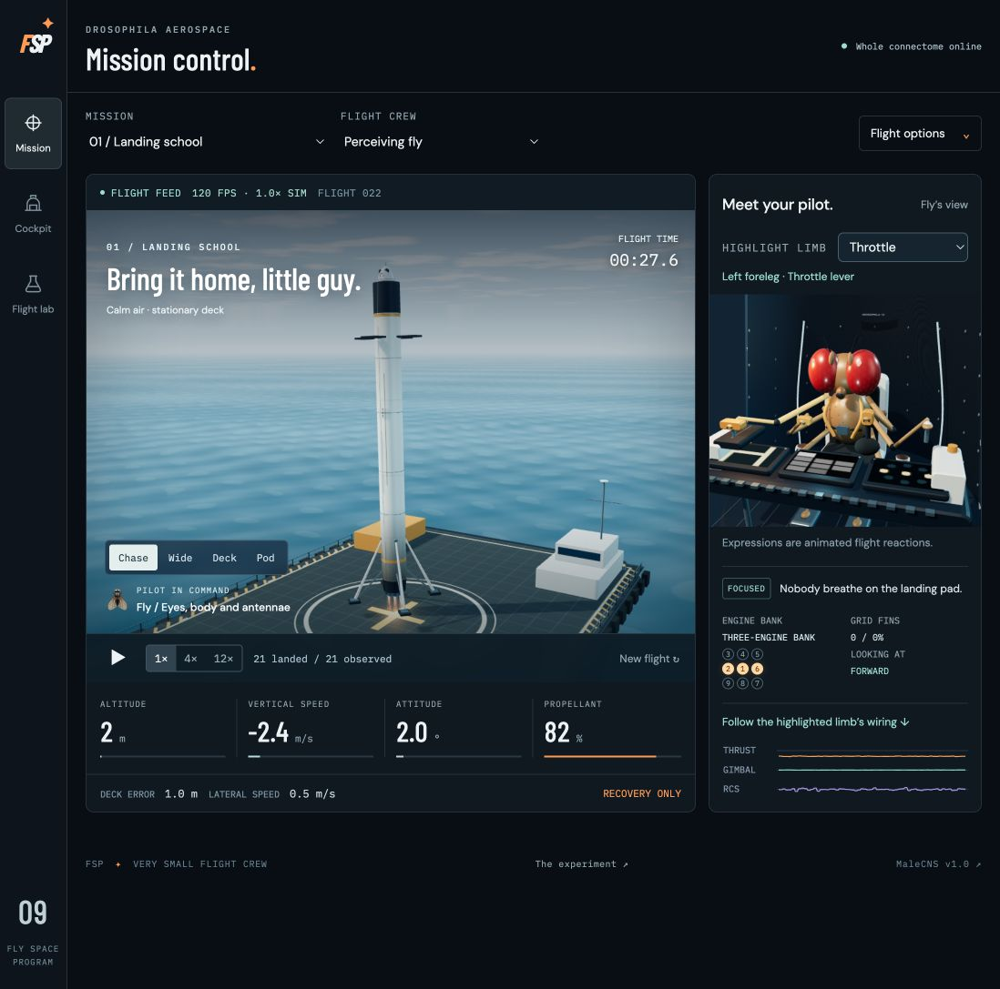
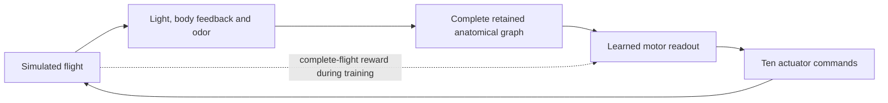
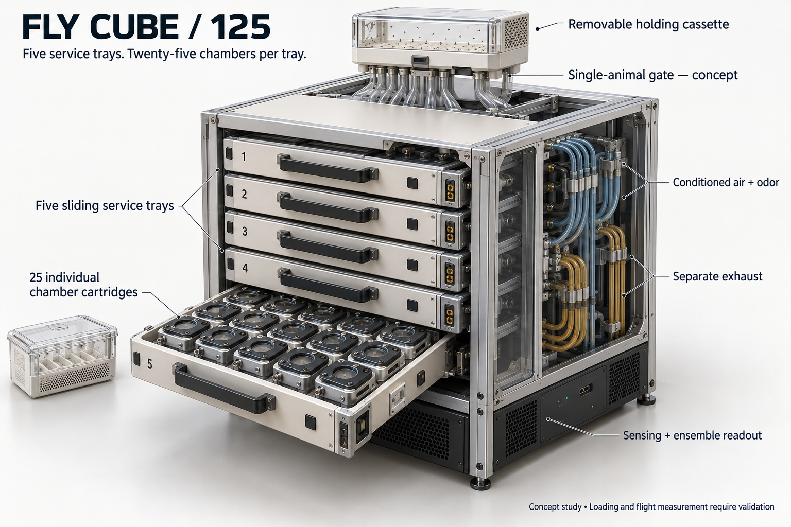

# Fly Space Program

**How far can we take a fly-derived controller before we have to build the little boxes?**

Fly Space Program is an ongoing computational-neuroscience and control experiment with a very small flight crew. It puts a measured fruit-fly connectome inside a simplified neural model, gives it modeled eyes, body feedback and odor inputs, and trains an external motor readout to control a simulated booster.

The ambition is to push fly training as far as we can in simulation, document what works and what fails, and make the next physical experiment concrete. The rockets and radio jokes are playful. The anatomical data, complete-network calculations, recorded experiments and unanswered questions are real parts of the project.

[Fly the simulator](https://fly-space-program.sarrington493484.chatgpt.site/) · [Read the docs](docs/README.md) · [Full status — September 14](docs/status-2026-09-14.md) · [Explore the science](docs/science-and-hypotheses.md) · [See the Fly Cube](docs/harness-concept.md)



*Actual simulator screenshot. The on-screen session counter is a local observation, not the formal benchmark. The fly's expression is animation.*

## A substantial model with an honest boundary

Every control decision makes two passes through **166,700 retained neurons and 25,582,938 directed connections**, representing **124,177,617 measured synaptic contacts**. All **2,129 descending/motor output neurons** contribute to a learned ten-command readout. The retained anatomical graph stays fixed during controller training.

The default **Perceiving fly** sees two 32 × 24 eye images, including light from a camera monitor and twelve flight indicators. Eighteen modeled body channels and four receptor-specific odor channels complete its 1,558 inputs. Flight indicators show measurements, not recommended actions. A language model does not choose its flight commands. A separately labeled instrument pilot provides a reference controller.



Measured wiring is an anatomical constraint, not a complete account of a living nervous system. Neuron dynamics, sensory encoding and the actuator mapping contain substantial modeling choices. The separate spiking-model studies investigate biological questions; they are not the controller that produced the landing result below. [Model details and provenance](docs/controller-and-provenance.md).

## What has actually been demonstrated

| Question | Current evidence |
| --- | --- |
| Can the released embodied controller land? | **60/80 safe landings** on unseen starts across ten missions; the prior controller achieved 54/80 on the same starts. All 20 failures are retained. |
| Does its visual presentation matter? | Covering both eyes or turning off flight indicators gave **0/80** in each matched control. |
| Has it mastered the entire program? | **No.** All 27 missions are available, but the release has final validation on only ten. |
| Did the latest ground experiment help? | Contact-based ranking landed **40/48 versus 36/48** fresh development starts after 4,608 training flights. It lost both Night shift cases; no controller was promoted. |
| Has the embodied pilot completed orbital missions? | The completed **588-flight ranking experiment and 156-flight proposal-size experiment produced no stable orbit, completed orbit or landing**. Further research is paused at the current stopping point. |
| Has chemical steering or transfer to living flies been established? | **No.** The biological studies retain negative results and unresolved model limitations. |
| Have the physical Fly Cubes been built? | **No.** They are design concepts for a future research apparatus. |

See the [released landing report](dist/assets/landing-report.json), [training guide](docs/suite-training.md), [ground-contact comparison](docs/ground-contact-comparison.md), [orbital ranking experiment](docs/orbital-progress-comparison.md), [proposal-size experiment](docs/orbital-local-comparison.md), and [biology research record](docs/biology-experiments.md). Development improvements and screenshots do not qualify a new release.

## The little boxes



*AI-generated concept art, not built hardware. Five trays × 25 cells = 125 proposed instrumented positions.*

The **Fly Cube** explores a possible physical counterpart: individually presented visual and mechanical cues, controlled odor delivery, and camera/optical measurements of fly movement. Published fly experiments support several component ideas. Whether those measurements could become a useful controller—and whether an ensemble helps—remains an empirical question.

The credible bridge starts with one measured cell and a simple closed-loop task. Packaging 125 cells, automatic loading, calibration, interference, handling and sustained behavior all remain unresolved. Nothing here establishes that a living fly can land a rocket. “Flies landing starships” is the long-range joke and motivation, not a hardware claim. [Concept gallery](docs/harness-concept.md) · [Physical research boundary](docs/physical-fly-interface.md).

## Run it locally

```sh
git clone https://github.com/steph4n-gh/fly-space-program.git
cd fly-space-program
npm ci
npm start
```

Open [localhost:4173](http://localhost:4173). Repository access is required while this project is private. The tracked graph assets ship with the app; the first browser load is about 91 MB. Use a desktop browser with WebGL 2 and allow the complete graph to load. Python 3 runs the local server; Node 24 is used for project checks. There is no build step for the authored static app.

**Mission** watches the flight. **Cockpit** shows the fly and exact sampled eye images. **Flight lab** contains training, anatomy and decision inspection. Ordinary flights do not update the controller; use **Train the fly** for local training. [Reproduction and data setup](docs/reproducibility.md).

## Explore and contribute

| Start here | Continue with |
| --- | --- |
| Understand the experiment | [Science and hypotheses](docs/science-and-hypotheses.md), [facts and FAQ](docs/facts-and-faq.md) |
| Inspect the implementation | [Controller and provenance](docs/controller-and-provenance.md), [reproduction guide](docs/reproducibility.md) |
| Review results and failures | [Research record](docs/README.md#research-record) |
| Imagine the physical apparatus | [Fly Cube gallery](docs/harness-concept.md), [physical interface](docs/physical-fly-interface.md) |
| Help improve the project | [Contributing](CONTRIBUTING.md), [project philosophy](PHILOSOPHY.md) |

We take inspiration from [Omarchy's doctrine](https://omarchy.org/doctrine/): serious work can be beautiful, opinionated, agent-assisted and fun. Our own commitments are **honor, strength, courage, duty, justice, beauty and truth**. That includes keeping failed experiments visible and letting evidence change the plan. This is an independent project, not an Omarchy or aerospace-company product.

## License and credit

Project code and documentation use the [No Theo License v1.0](LICENSE), an MIT-derived, person-excluding license. This is **source-available, not open source**. The repository stays private until the maintainer explicitly decides it is ready to become public.

The MaleCNS-derived anatomical data retains **CC BY 4.0**, and bundled third-party code retains its own licenses. Credit goes to the researchers and institutions behind [MaleCNS v1.0](https://male-cns.janelia.org/) and the cited experimental work. See [third-party notices and license provenance](THIRD_PARTY_NOTICES.md).
