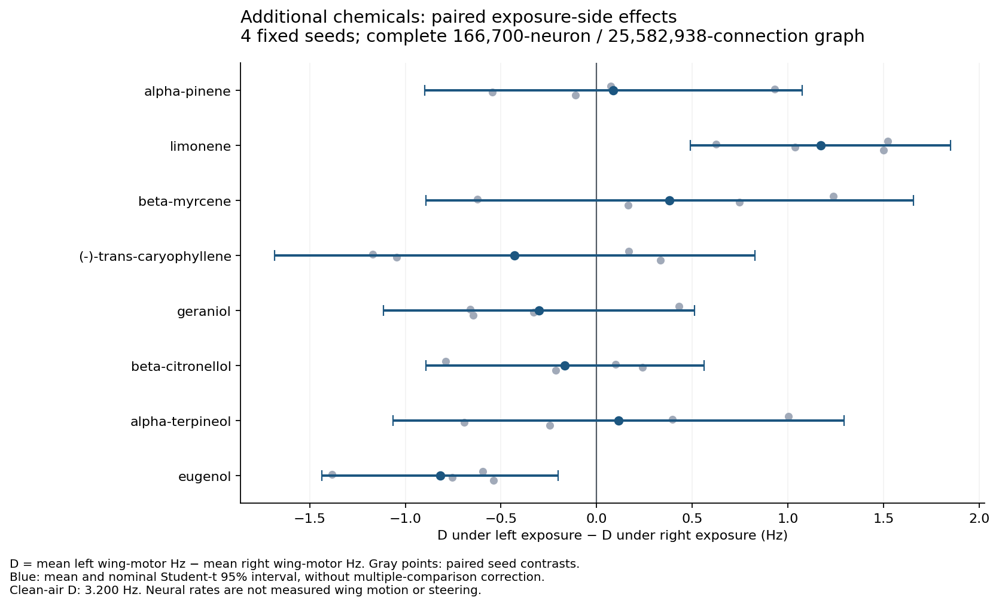
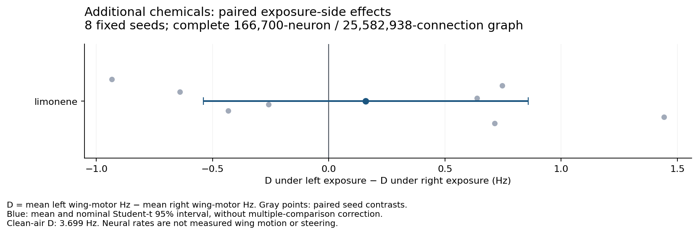

# Additional odor and terpene tests

**148 full-graph trials are complete. No additional chemical passed the
predefined gate for a steering follow-up.** Limonene's promising initial
four-seed response did not replicate on eight new seeds. Flavonoids had
insufficient measured airborne profiles for this assay; no input profiles
were invented.

This is an offline chemical-response screen in the complete **166,700-neuron,
25,582,938-connection** spiking model. The initial batch contains eight new
compounds, four fixed seeds, matched clean-air controls, and left-only,
right-only and bilateral exposure. It measures neural response differences;
there is no physical odor apparatus or animal calibration.

## Panel and evidence

The panel was fixed before observing its spiking results. Selection favors
chemical diversity and at least 20 measured response deltas among the 49
mapped DoOR units. These chemicals were included in the earlier broad rate
screen but had not been tested in the replicated spiking panel.

| Compound, exact atlas label | Type | Measured mapped units |
| --- | --- | ---: |
| alpha-pinene | Bicyclic monoterpene | 24/49 |
| limonene | Cyclic monoterpene | 23/49 |
| beta-myrcene | Acyclic monoterpene | 21/49 |
| (-)-trans-caryophyllene | Sesquiterpene | 26/49 |
| geraniol | Monoterpenoid alcohol | 28/49 |
| beta-citronellol | Monoterpenoid alcohol | 28/49 |
| alpha-terpineol | Monoterpenoid alcohol | 27/49 |
| eugenol | Aromatic phenol comparator | 29/49 |

Inputs come from the pinned
[DoOR.data consensus matrix](https://github.com/ropensci/DoOR.data/tree/db323a496577c4b4a72b5c2fcd1859e07521ffb5).
The exact InChIKeys, CAS numbers, source commit, source hashes and coverage are
retained in the experiment provenance. Atlas labels and stereochemical keys
are preserved; similarly named isomers are not merged. The derived DoOR
material retains **CC BY-SA 4.0** attribution to the DoOR contributors.

Systematic fly receptor recordings establish that chemical class, stimulus
strength and receptor identity affect response profiles; they do not assign
motor meanings to these chemicals ([Hallem and Carlson, 2006](https://doi.org/10.1016/j.cell.2006.01.050)).
A separate experiment linked citrus terpenes and Or19a to female oviposition
choice ([Dweck et al., 2013](https://doi.org/10.1016/j.cub.2013.10.047)).
That context is evidence for sensory relevance, not a predicted steering
response in this male connectome.

## Flavonoids and missing evidence

Quercetin is present in this atlas, but only **one of 49 mapped units** has a
measurement: Or71a. Its source is the `Dweck.2015.WT` column in
[the pinned Or71a dataset](https://github.com/ropensci/DoOR.data/blob/db323a496577c4b4a72b5c2fcd1859e07521ffb5/data/Or71a.csv).
The raw quercetin entry is **2 spikes/s**, versus 148 for eugenol and 207.333
for 4-ethylguaiacol in that dataset. The normalized quercetin consensus value
is 0.0876963; subtracting the consensus spontaneous value gives 0.0572090.
These transformed values are not concentration measurements or evidence
that this small raw response is significant. Quercetin therefore fails the
coverage criterion and was not supplied as a simulated airborne profile.

No matching entry exists in the pinned atlas for rutin, kaempferol, luteolin,
apigenin, naringenin, naringin, catechin, epicatechin or epigallocatechin
gallate. This is a limitation of the available input data, not evidence that
flies cannot respond to them by any sensory route.

Flavonoids such as catechins and flavonol glycosides are studied as
nonvolatile components in experimental tea chemistry
([Zhou et al., 2024](https://doi.org/10.1016/j.fochx.2024.101371)).
An airborne stimulus for the specific flavonoids above needs its own
delivery and receptor-response evidence; food or contact responses cannot
be substituted for antennal exposure.

The source experiment behind the sparse quercetin entry makes a useful
distinction: flies detected nonvolatile hydroxycinnamic acids through
yeast-produced **4-ethylphenol and 4-ethylguaiacol**, not by smelling the
acids directly ([Dweck et al., 2015](https://doi.org/10.1016/j.cub.2014.11.062)).
Hydroxycinnamic acids and these volatile proxies are chemically distinct
from flavonoids. The atlas has 22 mapped measurements for 4-ethylguaiacol and
six for 4-ethylphenol. They are possible future probes; neither was silently
substituted for quercetin in this batch.

## Fixed protocol and interpretation

Each condition uses seeds **370019, 377938, 385857 and 393776**, with 0.2 s of
spontaneous prewarm followed by a 0.6 s observation. There are **100 trials**:
four clean-air references shared by all matched comparisons and 12 trials
for each of eight chemicals. The existing `lif-odor-probe.py` is invoked
unchanged. All graph neurons and connections remain in every simulation.

The inherited parameters include a 0.1 ms step, 0.275 mV/contact and a
150 Hz scale from normalized DoOR responses to external Poisson input.
These are assumed simulation parameters, not physical doses. Unknown
receptor-response values retain the spontaneous reference. Unknown-side
ORNs receive no direct input; they remain in the recurrent graph.

The outcome is **D = mean left wing-motor-pool Hz − mean right
wing-motor-pool Hz**. Each pool is averaged per neuron before subtraction
(33 left, 34 right). We compare each exposure with its same-seed clean-air
reference. The directional contrast is **D under left exposure − D under
right exposure**. A large absolute D alone is not evidence for odor control.

The recorded exploratory gate requires an absolute paired directional
contrast of at least 1 Hz, the same sign in all four seeds, and a nominal
paired Student-t 95% interval excluding zero. This is a screening heuristic,
not a biological threshold. A passing candidate requires eight new
confirmation seeds before any bounded steering follow-up. Nominal intervals
are descriptive, assume approximately normal seed contrasts, and are not
corrected for the eight comparisons. Exact paired sign-flip p-values and
Holm corrections are also retained; with four seeds their resolution is
too coarse to establish an individual two-sided 5% result.

The transferred LIF dynamics remain uncalibrated for this circuit. The
earlier PN diagnostic found high firing and weak lateral differentiation;
the previous acid and linalool steering searches failed to demonstrate a
benefit. This panel does not resolve those limitations, map spikes to
measured wing motion, or establish steering, landing or learning in an
animal. The flight checkpoint and application are unchanged by this assay.

## Initial 100-trial results

All trials completed. Clean air already produced **D = +3.200 ± 0.260 Hz**
(mean ± sample SD across four seeds). The following values subtract that
same-seed reference; the final column contrasts left with right exposure.

| Compound | Left − air, Hz | Right − air, Hz | Bilateral − air, Hz | Left − right exposure, Hz |
| --- | ---: | ---: | ---: | ---: |
| alpha-pinene | +0.137 ± 0.484 | +0.049 ± 0.574 | +0.206 ± 0.827 | +0.088 ± 0.620 |
| limonene | +0.441 ± 0.265 | −0.730 ± 0.548 | −0.025 ± 0.631 | +1.171 ± 0.427 |
| beta-myrcene | +0.355 ± 0.166 | −0.027 ± 0.709 | −0.210 ± 0.376 | +0.382 ± 0.801 |
| (-)-trans-caryophyllene | −0.306 ± 0.818 | +0.122 ± 0.827 | −0.074 ± 0.498 | −0.428 ± 0.789 |
| geraniol | −0.617 ± 0.426 | −0.316 ± 0.319 | −0.298 ± 0.621 | −0.301 ± 0.510 |
| beta-citronellol | −0.357 ± 0.781 | −0.192 ± 0.342 | +0.432 ± 0.823 | −0.166 ± 0.456 |
| alpha-terpineol | +0.340 ± 0.317 | +0.224 ± 0.989 | +0.632 ± 0.618 | +0.115 ± 0.741 |
| eugenol | −0.346 ± 0.163 | +0.472 ± 0.392 | +0.081 ± 0.451 | −0.818 ± 0.388 |

Limonene alone passed the predefined replication gate: all four exposure-side
contrasts were positive, with a nominal 95% interval of **+0.491 to +1.851
Hz**. Eugenol's interval also excluded zero, but its magnitude was below the
1 Hz gate. The other six exposure-side intervals included zero. No initial
contrast survived the Holm-adjusted exact sign-flip analysis; the smallest
unadjusted two-sided p-value was 0.125. Limonene therefore proceeded to
independent replication, without treating discovery as proof of control.

In the limonene left-only condition, the mean DM1 projection-neuron rates
were approximately **299.6 Hz left and 300.4 Hz right**. The unresolved
high-rate, weakly lateralized PN response remains visible despite the small
wing-pool contrast.



The [complete paired results](additional-panel-summary.json)
retain every seed value, raw pool rates, clean-air differences, nominal
intervals and corrected sign-flip statistics. The simulation trials took
588.8 seconds in total, excluding graph setup and input verification.

## Independent limonene confirmation

The follow-up completed 48 trials: 16 exact repeats and 32 trials on eight
new seeds. Only the new seeds entered the confirmation analysis:
**401695, 409614, 417533, 425452, 433371, 441290, 449209 and 457128**.
All 16 repeated clean-air and limonene trials reproduced their previous
neural outputs exactly. This supports computational reproducibility while
the additional seeds test whether the initial pattern is reliable.

On the new seeds, the paired exposure-side contrast fell to **+0.159 ±
0.835 Hz**, with nominal 95% interval **−0.539 to +0.858 Hz**. Four seed
contrasts were positive and four negative; the exact two-sided sign-flip
p-value was 0.59375. This fails the predefined confirmation requirements
of at least 1 Hz magnitude, the original effect direction, at least seven
same-sign seed contrasts, and an interval excluding zero. No steering
experiment was launched.

The new-seed clean-air imbalance was **+3.699 ± 0.702 Hz**. Relative to
same-seed clean air, limonene changed D by −0.354 ± 0.788 Hz for left-only
exposure, −0.514 ± 1.006 Hz for right-only exposure, and −0.310 ± 0.806 Hz
for bilateral exposure. All three nominal paired intervals included zero.
The smaller directional effect and variable baseline reinforce the need
to calibrate circuit responses before interpreting a motor-pool difference
as control authority.



The [confirmation record](additional-limonene-confirmation-summary.json)
retains every independent seed contrast and the exact-repeat checks. Its
simulation trials took 296.5 seconds. Across both stages there were **148
completed trials, 132 distinct condition/seed combinations, and zero
execution failures**. The confirmation failure is retained as a scientific
result. These tests do not exclude smaller effects or effects under a
better-calibrated model.

## Reproduction

From the repository root, with the existing graph, annotations and pinned
Brian2 environment:

```sh
artifacts/lif-runtime/bin/python scripts/additional-odor-sources.py
artifacts/lif-runtime/bin/python scripts/additional-odor-tests.py
artifacts/lif-runtime/bin/python scripts/additional-odor-summary.py --export-docs
artifacts/lif-runtime/bin/python scripts/additional-odor-tests.py --output-stem additional-limonene-confirmation --odors limonene --seeds 12
artifacts/lif-runtime/bin/python scripts/additional-odor-summary.py --stem additional-limonene-confirmation --skip-first-seeds 4 --export-docs
```

The runner refuses to overwrite a prior result. Use `--output-stem
additional-panel-rerun` for another run, then pass `--stem
additional-panel-rerun` to the summarizer. The initial provenance is written
before simulation and records 49 input-file hashes; the final record adds
the complete report hash and exit status. The summarizer checks every
input hash, trial identity and completion count before computing paired
effects. All trials, raw source data and failures are retained under
`artifacts/odor-interface/additional-*`.

With existing completed trials, run just the two summarizer commands above
to regenerate the repository copies without rerunning a neural simulation.
The `--export-docs` option copies each summary into `docs/` and its figure
into `docs/assets/`, verifies SHA-256 equality with the artifact source, and
prints the export hashes. Each summary retains the full raw report's hash
and provenance hash; raw trials and source data remain under `artifacts/`.
