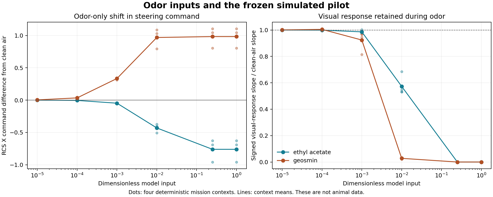

# Experiments to influence fly behavior

**The first biological priority is odor-dependent visual control.** We should
measure whether an odor changes a fly's response to a defined visual cue,
then ask whether that change improves a simple closed control loop. The
software can currently test interactions between its existing odor inputs
and a frozen learned controller. It cannot yet predict a living fly's drug
response, learning or flight performance.

The earlier chemical work is useful negative evidence: the
[148-trial panel](additional-odor-tests.md) did not yield a confirmed steering
candidate, and the [68-trial calibration follow-up](odor-calibration-followup.md)
exposed a tradeoff between excessive projection-neuron firing and absent
motor spikes. Neither result rules out real odor effects. Both argue for
measuring a biological response before expanding the molecule search.

## Experiments, in order

| Experiment | Manipulation and matched comparison | Primary measurement | What it would establish |
| --- | --- | --- | --- |
| 1. Odor changes visual stabilization | Repeat the same visual yaw perturbations in clean air and a food-odor condition, with matched carrier flow | Baseline-corrected left/right wing-stroke difference, response latency and trial repeatability | Whether odor changes visual response strength or timing in an individual fly |
| 2. Odor changes the target's meaning | Present a small visual target and a tall bar with and without food odor; counterbalance target side | Signed approach or avoidance, plus fixation error in a later closed-loop test | Whether odor can select a useful tracking behavior |
| 3. Teach a cue association | Pair one odor with a sucrose reward delivered through a contact/feeding route; compare with explicitly unpaired presentations | Preference or tracking change when tested later without reward | Associative learning beyond immediate odor attraction |
| 4. Characterize timing and state | Compare pulse timing, repeated exposure and recorded feeding/flight state for a compound that passed an earlier test | Effect onset, recovery, habituation and between-session reproducibility | The usable operating range and whether the effect persists |
| 5. Test a mechanism | With a suitable experimental preparation, compare targeted manipulation of the implicated octopaminergic circuit with its controls | Change in the same visual response, while preserving baseline sensory and movement measurements | A causal contribution of the circuit in that task |

These are proposed animal experiments, not completed work. Start with one
measurable behavior in a single-cell apparatus. The
[125-cell harness concept](harness-concept.md) comes after the readout and
individual response are demonstrated.

### 1. Visual stabilization is the strongest first target

Chow and colleagues found that attractive odor altered two visual control
responses differently: yaw stabilization increased while sideslip response
gain decreased. This makes a single global “more active” score insufficient.
Measure yaw and sideslip separately; record both response strength and error.
[Chow et al., 2011](https://pmc.ncbi.nlm.nih.gov/articles/PMC3749065/).

Wasserman and colleagues paired vinegar with visual motion and measured
enhanced optomotor responses and odor-sensitive activity in a visual
interneuron. Their work implicates octopaminergic signaling in this
interaction. A direct replication-style behavioral comparison would be a
better first biological anchor than assuming a terpene should turn a wing.
[Wasserman et al., 2015](https://pmc.ncbi.nlm.nih.gov/articles/PMC4331282/).

Use a characterized food-odor stimulus as the positive benchmark. Record its
composition and measured delivery: vinegar is a mixture, and its effect
cannot be assigned to ethyl acetate alone. A defined single compound can be
a separate comparison. The current simulator's ethyl-acetate input represents
one annotated receptor pathway, not the full measured response to vinegar.

The endpoint is the **odor × visual-stimulus interaction**. Compare the
visual response in odor with the same visual response in clean air, after
subtracting any odor-only movement. Stronger spontaneous wing motion without
better stimulus tracking is a different result.

### 2. Target approach is a distinct useful behavior

Cheng and colleagues found that apple-cider-vinegar odor and ethanol odor
could reverse avoidance of a small visual object into approach in tethered
flight; benzaldehyde did not produce that reversal. This suggests a way to
change the behavioral meaning of a display feature. It does not show that
any attractive odor will have the same effect or that more exposure improves
performance. [Cheng et al., 2019](https://pmc.ncbi.nlm.nih.gov/articles/PMC6615044/).

First measure the signed response under externally imposed visual motion.
Only then let the measured movement control the target position. Compare
closed-loop tracking with a replay of the same visual sequence that is
independent of that animal's current movements. This separates movement
evoked by an appealing display from effective use of feedback.

A recent flight study showed that self-generated visual feedback and E-PG
compass neurons contribute to maintaining heading in an odor plume. Removing
that feedback impaired plume tracking even with odor present. This reinforces
the need to test the entire sensory feedback loop.
[Currea et al., 2026](https://escholarship.org/uc/item/8cw337sz).

### 3. Reward learning needs a separate learning assay

An odor can be a cue; sucrose can provide a reward through taste and ingestion.
Compare paired odor/reward presentations with unpaired presentations, an
odor-only group and a reward-only group. Counterbalance which odor predicts
reward, measure initial preferences, and test later with reward absent.
Preserve individual animal and session identities.

Published experiments place octopamine and specific dopamine populations in
layered appetitive reinforcement pathways. This supports a learning
hypothesis, not a rule that dopamine always means reward or that spraying a
neuromodulator recreates that circuit.
[Burke et al., 2012](https://www.nature.com/articles/nature11614).

The current fixed-connectome assays have no validated synaptic plasticity or
reward-circuit dynamics. Changing the external readout after a score is
software learning. It cannot serve as evidence that an odor association was
learned inside the simulated biological circuit.

### 4. Timing, mixtures and internal state

For a repeatable effect, compare simultaneous odor/visual presentation with
odor preceding the cue, the same odor arriving later, and time-shuffled
presentations with equal total exposure. Record onset and clearance at the
animal rather than assuming a valve command gives the received waveform.
Repeated blocks with washout distinguish a transient effect from carryover.

Record sex, genotype, age, feeding state, prior exposure and whether the fly
is actively flying. Use independent animals and sessions to assess
generalization. A change in inactive time should remain an outcome, not be
silently removed to make the remaining steering responses look stronger.

Mixtures should follow confirmed single-stimulus effects. Compare A alone,
B alone, A+B and carrier, with actual delivered levels measured in all four
conditions. Receptor responses may be nonlinear, so summing two atlas vectors
cannot establish synergy. Novel compounds likewise require measured or
separately validated receptor-response predictions before the connectome
can supply a defensible hypothesis about their downstream effects.

Geosmin is a useful sensory-pathway comparator because experiments linked it
to Or56a neurons and DA2. That specificity does not make it a universal
negative reward signal for every flight task.
[Stensmyr et al., 2012](https://doi.org/10.1016/j.cell.2012.09.046).

### 5. Octopamine is a mechanism to test, not a concentration knob

The targeted-circuit question is whether manipulating the implicated pathway
changes the same visual endpoint. Appropriate comparisons include the
matched genetic background, stimulus without the actuator, and actuator
without odor; baseline vision and movement need separate measurements.
Neuromodulator receptor expression, target cells and intervention timing
matter. A transmitter annotation alone does not specify them.

For this project, octopamine-related visual modulation is a more specific
initial hypothesis than whole-brain excitation. Dopamine-related reinforcement
belongs with the learning assay. Our rate model's global activation gain is
an arbitrary numerical sensitivity parameter and has no validated mapping
to either molecule. A bath, feeding intervention, circuit stimulation and
an airborne odor are different experimental routes and need their own
calibration.

## Measurements required before choosing an effective intervention

Record animal/session identity, condition and randomized order, received
stimulus waveform, measured carrier flow, visual sequence, movement trace,
tracking quality and exclusions. Keep raw traces and failed trials. The
animal is the replication unit; repeated frames are not additional animals.
Use a pilot to estimate between-animal variability before fixing the size of
an independent confirmatory cohort.

The first success criterion should be a repeatable, directionally appropriate
response to the visual cue. The next criterion is reduced error in a simple
closed loop on separate animals or sessions. Only then test a simulated
landing task with a frozen movement-to-control mapping. Increased activity,
larger neural signals, and improved training reward are insufficient alone.

## Current software experiment

`scripts/assay-odor-visual-context.mjs` freezes the earlier four-mission
checkpoint and runs the complete graph through the JavaScript backend. It
crosses four starting contexts with five odor conditions, three visual
pitch-view steps and covered/uncovered eyes: **120 trajectories, 3,840 neural
decisions**. Conditions are clean air and bilateral ethyl-acetate or geosmin
model inputs at levels 0.25 and 1. These levels are dimensionless inputs,
not chemical concentrations.

Every trajectory begins from a cold network and records eight baseline,
twelve stimulus and twelve washout decisions. Within each context, all
eighteen non-odor body inputs are identical. The source preserves all ten
commands and activity in the four odor-input populations at each decision.
It checks that pre-stimulus records match and that covering the eyes removes
the visual-step differences.

The resulting record separates odor-only command shifts from changes in the
response slope across the two signed visual perturbations. The task uses
rendered mission images and instrument lights; it is **not** a reproduction
of panoramic optomotor behavior. Its four contexts are not independent brains.
It supplies a software sensitivity result, without a flight-success claim,
learning claim, physical dose or claim of octopaminergic physiology.

Results are written incrementally to
`artifacts/odor-interface/visual-context-v1.json`; `complete` becomes true only
after every trajectory and consistency check finishes. The file records the
checkpoint, source hashes, protocol and full traces.

### First completed assay

All 120 trajectories completed. At both 0.25 and 1, the two odor inputs
produced large, oppositely signed command shifts. In the four visible
contexts, ethyl acetate shifted the throttle command by approximately
+0.94 to +1.03, while geosmin shifted it by −0.89 to −0.95. Commands have a
range of −1 to +1; these are substantial changes in that model scale.

The RCS X response to the signed visual step fell to effectively zero in
every odor condition, compared with clean-air slopes of approximately
−1.26 to −1.35 command units per radian of rendered pitch change. Covered-eye
controls had exactly zero visual interaction. The largest remaining paired
command difference after twelve washout decisions was 0.000085.

This is strong influence on the **external learned controller**, accompanied
by loss of visual sensitivity. The readout was trained with automatic odor
off. These new odor inputs lie outside that training regime, so the result
also exposes sensitivity to unfamiliar neural activity. It does not
establish innate attraction, aversion, octopamine release, better steering
or a useful physical intervention.

The [verified result record](odor-visual-context-results.json) retains all
paired effects and hashes of the complete trajectories.



A follow-up fixes four smaller model levels, 0.00001, 0.0001, 0.001 and 0.01,
before evaluation. It uses the same conditions and controls: 216 additional
trajectories, with no parameter learning or dose selection. Its purpose is
to measure where command shifts occur without erasing the visual response.
The rationale and full planned matrix are retained in
`artifacts/odor-interface/visual-context-low-input-plan.json`.

### Completed response curve

The follow-up completed all 216 trajectories. Together the two assays
contain **336 trajectories and 10,752 complete-graph decisions**. The table
shows the range across four visible mission contexts, not confidence
intervals or variation between animals. Visual response means the signed
RCS X response slope divided by its matched clean-air slope.

| Input | Model level | Odor-only RCS X command shift | Visual response retained |
| --- | ---: | ---: | ---: |
| Ethyl acetate | 0.00001 | −0.00049 to −0.00047 | 99.99–100.01% |
| Ethyl acetate | 0.0001 | −0.00492 to −0.00470 | 99.85–100.08% |
| Ethyl acetate | 0.001 | −0.0491 to −0.0458 | 97.99–100.21% |
| Ethyl acetate | 0.01 | −0.508 to −0.372 | 53.06–68.43% |
| Geosmin | 0.00001 | +0.00335 to +0.00348 | 99.94–100.11% |
| Geosmin | 0.0001 | +0.0337 to +0.0348 | 99.20–101.02% |
| Geosmin | 0.001 | +0.312 to +0.344 | 81.43–96.97% |
| Geosmin | 0.01 | +0.793 to +1.087 | 2.01–3.15% |

Small inputs can therefore shift this model's commands while preserving
most visual sensitivity. Larger inputs increasingly overwhelm that
sensitivity. The values near 100% do not establish improved visual gain:
they include small context-dependent increases and decreases. The input
effect is measured through the learned readout and does not identify a
biological steering direction or effective concentration.

Both assays used bilateral input. A fixed directional command bias is
therefore particularly important to distinguish from real lateral odor
localization. No chemical setting has been selected or installed, and no
additional landing performance is established by these static responses.
The completed flight comparison below tests whether one fixed small input
helps or harms a complete closed-loop flight on separate starts. The next
biological question remains whether the real odor/visual interaction can
be measured and replicated in one fly-cell apparatus.

```sh
node scripts/assay-odor-visual-context.mjs
node scripts/assay-odor-visual-context.mjs artifacts/odor-interface/visual-context-low-input.json .00001,.0001,.001,.01
artifacts/lif-runtime/bin/python scripts/summarize-odor-visual-context.py artifacts/odor-interface/visual-context-v1.json artifacts/odor-interface/visual-context-low-input.json
```

The assay refuses to overwrite a completed result; use a different output
path for repetition. The summarizer verifies full completion, source and
checkpoint hashes, every trial identity, startup/covered-eye controls and
recomputed paired effects before exporting the result and figure.

### Completed chemical flight comparison

The next assay froze the same four-mission controller and a bilateral input
level of **0.0001**, then ran 16 new starts in clean air, ethyl acetate and
geosmin: **48 complete JavaScript flights**. Each of the four missions had
two nominal and two varied starts. Odor stayed constant from the first
decision to the original physical endpoint. Body inputs, flight physics,
success criteria and readout weights were unchanged. The planned cases and
level were saved before running; no controller or chemical setting was
selected from these outcomes.

| Condition | Safe landings | Nominal | Varied | Rescued clean-air failures | Spoiled clean-air successes |
| --- | ---: | ---: | ---: | ---: | ---: |
| Clean air | 10/16 | 8/8 | 2/8 | — | — |
| Ethyl acetate | 9/16 | 6/8 | 3/8 | 1 | 2 |
| Geosmin | 9/16 | 7/8 | 2/8 | 1 | 2 |

Neither odor improved the aggregate landing count. Mean paired flight-score
changes were −10.87 for ethyl acetate and −9.34 for geosmin. All failures
remain in the [verified paired record](odor-closed-loop-results.json),
including the two harmed cases for each odor. A command shift with largely
preserved static visual sensitivity was insufficient to improve this flight
cohort.

The clean-air result also limits the earlier **28/32** checkpoint claim:
that number remains the outcome of its original test cohort. On these 16
additional starts the same checkpoint landed 10/16, with only 2/8 in varied
conditions. Report the separate cohorts rather than treating the earlier
rate as a guarantee. This pilot neither identifies an effective odor dose
nor tests a living fly's chemical response.

These chemical results belong to the
[archived four-mission checkpoint](assets/four-mission-checkpoint.json).
The subsequently released ten-mission checkpoint was tested with chemical
inputs off; its landing results do not establish an odor benefit.

The optional `SUITE_TEST_ODOR_LEVEL` evaluation input changes only the four
odor channels. A complete clean-air flight through the added input-handling
path exactly matched its previously archived outcome. Reproduce the frozen
pilot with the recorded plan in
`artifacts/odor-interface/closed-loop-plan.json`, then run:

```sh
node scripts/summarize-odor-flights.mjs
```

## Anatomical candidates and a spiking-model check

The [amine-target inventory](neuromodulator-targets.json) checks all 166,700
retained cells, 25,582,938 edges and 124,177,617 contacts. Packed cell IDs,
types and transmitter labels were independently matched to the original
annotation and transmitter-consensus files; every used packed array was
hash-checked. It finds 101 octopamine-labelled, 392 dopamine-labelled and
48 serotonin-labelled cells.

Four cells typed **OA-AL2i2** account for the direct octopamine-labelled
contacts into the explicitly named T4a–d and T5a–d populations:

| Body ID | Contacts into T4 | Contacts into T5 |
| --- | ---: | ---: |
| 10269 | 63 | 34 |
| 10265 | 53 | 23 |
| 10322 | 53 | 26 |
| 10204 | 50 | 24 |
| Total | 219 | 107 |

These contacts reach 208 of 6,861 named T4 cells and 102 of 6,719 named T5
cells. Four `T4_unclear` cells and one `T5a_unclear` cell are explicitly
excluded from those named pools. The inventory also finds 257,945 contacts
from 347 dopamine-labelled cells into 4,063 of the 4,064 annotated Kenyon
cells, which supplies a separate anatomical starting point for the learning
question. None of these counts specifies receptor expression, release,
synaptic efficacy, extrasynaptic signaling or plasticity. No matching Hx
type label was found, so we do not identify these cells as the Hx pathway
from the visual-modulation paper.

### Odor recruitment of the four candidate cells

The transferred complete-graph LIF model ran **28 trials**: clean air plus
left, right and bilateral ethyl acetate or geosmin, each with four matched
Poisson seeds. Observation pools were chosen from the anatomy before
observing activity. The original model equations, graph construction and
input parameters were preserved: 0.275 mV per signed contact, 150 Hz external
source scale, 0.2 seconds of pre-exposure and 0.6 seconds of observation.
These are model parameters, not physical exposure settings. All original
clean-air outputs exactly matched the four previously archived trials.

| Observed population | Clean-air mean firing, Hz | Bilateral ethyl-acetate change, Hz | Bilateral geosmin change, Hz |
| --- | ---: | ---: | ---: |
| All 101 octopamine-labelled cells | 58.60 | −0.008 | −0.136 |
| OA-AL2i2, body 10269 | 113.33 | +0.42 | +2.50 |
| OA-AL2i2, body 10265 | 104.17 | +1.25 | −0.83 |
| OA-AL2i2, body 10322 | 101.67 | −0.42 | −0.42 |
| OA-AL2i2, body 10204 | 87.92 | +3.75 | −0.83 |
| Named T4 population | 0 | 0 | 0 |
| Named T5 population | 0 | 0 | 0 |

Changes are paired to clean air at the same seed, then averaged across the
four trials. Ethyl acetate raised cell 10204 by 1.67–6.67 Hz across those
seeds; geosmin raised cell 10269 by 1.67–5 Hz. Most other bilateral cell
effects varied in sign or included zero. The all-octopamine population did
not show a consistent overall increase. These modest changes sit on already
high modeled baseline firing; four random seeds in one connectome do not
establish repeatability across animals.

No visual stimulus was supplied. T4 and T5 remained silent in every trial,
so this assay cannot test enhanced visual gain. Octopamine-labelled cells
still use the same LIF equations and assumed signs as other neurons; there
is no receptor-dependent neuromodulatory mechanism. The result identifies
limited odor-dependent activity in anatomical candidates, without showing
octopamine release, a causal visual effect or useful chemical control.
All seven conditions, per-seed counts and verification details are retained
in the [recruitment result](neuromodulator-recruitment-results.json).

```sh
artifacts/lif-runtime/bin/python scripts/map-neuromodulator-targets.py
artifacts/lif-runtime/bin/python scripts/lif-odor-probe.py --odors 'ethyl acetate' geosmin --seeds 4 --extra-pools artifacts/odor-interface/neuromodulator-pools.json --output artifacts/odor-interface/lif-neuromodulator-recruitment.json
artifacts/lif-runtime/bin/python scripts/summarize-neuromodulator-recruitment.py
```

Use a new output path for a repetition; preserve the original raw result
and pool definition. The next useful model development is a separately
validated visual response and receptor-dependent modulation, anchored to
the same behavioral endpoint. Adding a global excitation knob cannot supply
that missing physiology. The first real experiment remains the controlled
food-odor × visual-motion comparison above.

### Extend the anatomical candidates to the inputs of motion detectors

Restricting the anatomical search to direct T4/T5 contacts misses a relevant
experimental route. Strother and colleagues found behavioral-state changes
in T4 and its Mi1, Tm3, Mi4 and Mi9 inputs. Octopaminergic input increased
Mi4 excitability, and octopamine neurons supported sustained responses to
fast visual motion in walking flies. These results motivate measuring the
input populations as well as T4; they do not establish odor-driven flight
control. [Strother et al., PNAS](https://www.janelia.org/publication/behavioral-state-modulates-visual-motion-pathway-drosophila)

A separate experiment found that octopamine-receptor activation shifted
T4/T5 temporal tuning toward higher frequencies, with the shift explained
by faster input dynamics. A useful assay must therefore measure response
timing and frequency tuning, alongside response magnitude.
[Arenz et al., Current Biology](https://pubmed.ncbi.nlm.nih.gov/28343964/)

The [expanded inventory](visual-modulation-targets.json) adds exactly named
Mi1, Tm3, Mi4, Mi9 and L5 populations. It checks all 166,700 retained cells,
25,582,938 directed edges and 124,177,617 synaptic contacts against the
packed graph and original annotations. All nine original amine/target
comparisons remain identical to the earlier inventory.

| Target population | Annotated cells | Cells reached by octopamine-labelled sources | Directed edges | Synaptic contacts |
| --- | ---: | ---: | ---: | ---: |
| Mi1 | 1,773 | 358 | 384 | 425 |
| Tm3 | 2,054 | 1,007 | 1,273 | 1,556 |
| Mi4 | 1,772 | 205 | 216 | 242 |
| Mi9 | 1,775 | 128 | 131 | 140 |
| L5 | 1,787 | 281 | 295 | 315 |

Each of the first four populations receives contacts from the same 14
octopamine-labelled cells: four OA-AL2i2, four OA-AL2i3, two OA-AL2i4 and
four OA-ASM1. The four OA-AL2i3 cells account for 149 of the 242 contacts
into Mi4 and 1,270 of the 1,556 into Tm3. They are also the only annotated
octopamine sources contacting L5 in this inventory.

| OA-AL2i3 body ID | Contacts into Mi4 | Contacts into Tm3 | Contacts into L5 |
| --- | ---: | ---: | ---: |
| 10825 | 46 | 381 | 87 |
| 10226 | 37 | 264 | 84 |
| 10658 | 35 | 262 | 74 |
| 10687 | 31 | 363 | 70 |

The previous four-cell recruitment assay observed OA-AL2i2, so a follow-up
was needed to measure these additional candidates' odor responses. The expanded
inventory is anatomical evidence only: larger contact counts do not show
greater modulation, receptor expression, release, or a suitable chemical
exposure. Nor do these labels identify the exact physiological cells in
the cited experiments.

The next visual assay should first establish a repeatable clean-air
response to both directions of motion at slow and fast temporal
frequencies, using matched luminance and contrast. Then compare that same
stimulus with food odor, measuring Mi4/T4 response timing and the behavioral
stabilization response. Include static and no-motion controls and retain
the matched airflow, replay and independent-animal controls described
above. The software model also needs a validated visual response before
using these candidates to test a receptor-dependent mechanism; its silent
T4/T5 odor-only trials supply no evidence about visual modulation.

```sh
artifacts/lif-runtime/bin/python scripts/map-neuromodulator-targets.py --motion-inputs --output docs/visual-modulation-targets.json
```

### Completed recruitment assay of the upstream candidates

The follow-up completed all **28 planned odor-only trials**, observing the
14 octopamine-labelled candidates and the five additional visual input
populations. It used the same seven conditions and four matched Poisson
seeds as the original assay, with unchanged neuron equations, graph,
source inputs and timing. Every original trial output, including the
previously observed cell pools, matched exactly.

| Additional candidate | Clean-air mean firing, Hz | Bilateral ethyl-acetate change, Hz | Bilateral geosmin change, Hz |
| --- | ---: | ---: | ---: |
| OA-AL2i3, body 10825 | 144.17 | +1.67 | +2.08 |
| OA-AL2i3, body 10226 | 139.58 | +1.67 | +0.83 |
| OA-AL2i3, body 10658 | 145.42 | +0.83 | −0.42 |
| OA-AL2i3, body 10687 | 143.75 | +1.25 | +0.83 |
| OA-AL2i4, body 10677 | 149.17 | +2.08 | −1.67 |
| OA-AL2i4, body 10652 | 139.17 | −2.50 | −0.83 |
| Each of the four OA-ASM1 candidates | 0 | 0 | 0 |

These changes are small relative to the modeled baseline firing and
mostly vary in sign across seeds. Ethyl acetate's effect on body 10825
was nonnegative in all four trials, but two changes were zero. The two
OA-AL2i4 cells changed in opposite directions on average. The assay does
not support treating all octopamine-labelled neurons as one odor-controlled
gain signal.

Mi1, Tm3, Mi4, Mi9, L5, T4 and T5 remained silent in every trial. No visual
stimulus or receptor-dependent modulation was supplied, so this result
neither establishes visual enhancement nor rules it out in a real fly.
It leaves visual-response qualification as the next required step.

The [complete result](visual-input-recruitment-results.json) retains every
condition and candidate, including the four previously measured OA-AL2i2
cells. It also references 28 verified binary files containing each of the
166,700 neurons' spike counts. Pool totals, active-cell counts and whole-brain
totals were independently recomputed from those files. These aggregate
counts allow later anatomical questions without rerunning the experiment;
they do not preserve spike timing or establish response kinetics.

```sh
artifacts/lif-runtime/bin/python scripts/lif-odor-probe.py --odors 'ethyl acetate' geosmin --seeds 4 --extra-pools artifacts/odor-interface/visual-input-neuromodulator-pools.json --save-spike-counts --output artifacts/odor-interface/lif-visual-input-recruitment.json
artifacts/lif-runtime/bin/python scripts/summarize-neuromodulator-recruitment.py --visual-inputs
```

Use a new output path for any repetition; the original complete count files
are preserved and the script refuses to overwrite their directory.
