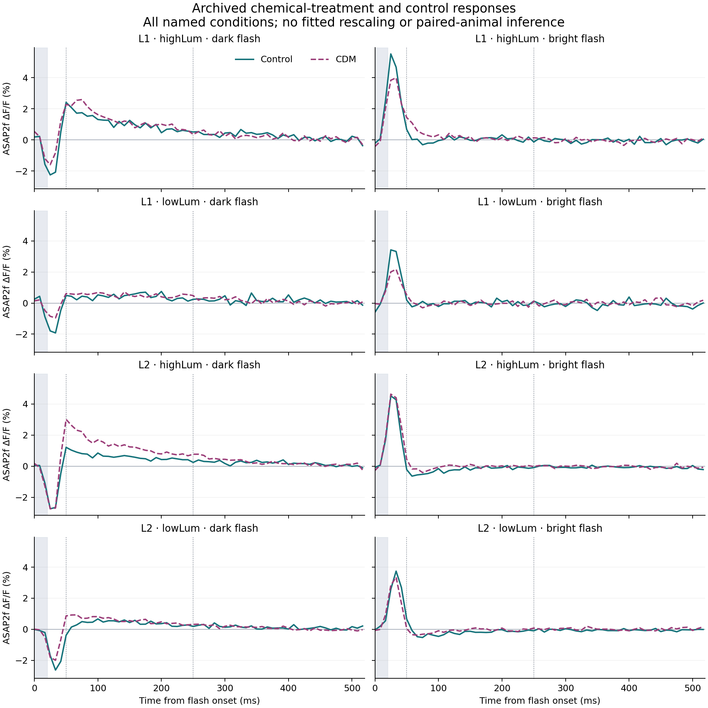

# Measured chemical modulation of visual responses

The archived chlordimeform (CDM) recordings show a larger late dark-flash
rebound in all four named L1/L2 conditions. Their early signed window means
are smaller. Bright-flash changes differ by cell and condition. This supplies
a measured chemical-response constraint for model development, without yet
establishing a chemical that improves steering.

These are measured ASAP2f fluorescence responses from the
[Pang et al. experiment](https://pmc.ncbi.nlm.nih.gov/articles/PMC11769683/),
obtained from the authors' [CC BY 4.0 archive](https://doi.org/10.5281/zenodo.13367946).
CDM is an octopamine agonist applied through the brain bath in that experiment.
This route differs from delivering an airborne odor to an intact fly.

## Complete comparison

The calculation retains every sample of all eight CDM/control pairs:
L1 and L2, both compact `highLum`/`lowLum` conditions, and dark and bright
20-ms flashes. The authors' notebook explicitly pairs these filenames. The
compact labels' physical-radiance mapping and animal pairing remain unverified.
Consequently these are named-condition population comparisons, with no
paired-animal effect or concentration-response estimate.

The analysis fixed four windows before opening the new CDM response values:
early 0–50 ms, late 50–250 ms, recovery 250–500 ms, and whole 0–500 ms.
Means integrate the exact overlap with each stored trailing 1/120-second bin.
All 63 recorded bins, including the final bins beyond 500 ms, remain in the
trace comparison and its separate whole-record RMS difference. The control
traces had already been inspected during earlier model development.

The table expresses signed means in percentage points of fluorescence ΔF/F.
The early sign follows the initial expected response: negative raw fluorescence
for a dark flash and positive for bright. The late sign is the opposite.
A positive late value therefore means a rebound in that expected direction;
a negative value means the window average has the initial response's sign.

| Cell / named condition | Flash | Early control | Early CDM | Late control | Late CDM |
| --- | --- | ---: | ---: | ---: | ---: |
| L1 / highLum | Dark | 0.457 | −0.017 | 1.057 | 1.267 |
| L1 / highLum | Bright | 2.644 | 2.258 | −0.027 | −0.204 |
| L1 / lowLum | Dark | 0.690 | 0.258 | 0.404 | 0.506 |
| L1 / lowLum | Bright | 1.580 | 1.103 | 0.011 | 0.038 |
| L2 / highLum | Dark | 0.949 | 0.519 | 0.586 | 1.285 |
| L2 / highLum | Bright | 2.021 | 2.325 | 0.222 | 0.050 |
| L2 / lowLum | Dark | 1.174 | 0.690 | 0.398 | 0.565 |
| L2 / lowLum | Bright | 1.737 | 1.472 | 0.211 | 0.094 |

Early window means are **not first-peak amplitudes**. A rebound can already
occur before 50 ms, causing cancellation; this accounts for the near-zero,
oppositely signed L1 highLum dark-window mean. The fixed windows also differ
from the paper's response-dependent phase boundaries. Neither smaller early
means nor larger later means establish a change in a unique physiological
parameter.

The CDM files contain 56, 33, 102 and 91 recorded traces per polarity for
L1 highLum, L1 lowLum, L2 highLum and L2 lowLum respectively. Each array's mean
reproduces its stored population mean within `1e-12` fractional fluorescence.
These counts are not assumed to be independent animals. The corresponding
compact control files contain means only, so no animal confidence intervals
or significance tests are reported.

## Implication for the model

The results motivate testing the paper's sign-dependent recurrent-feedback
mechanism, in which the delayed feedback depends on the neuron's response
sign. A useful development check is whether increasing feedback strength
alone produces the observed dark-response changes while retaining all bright
conditions. A lower fitting error would not, by itself, validate that
chemical explanation. Effective feedback coefficients have no established
mapping to CDM concentration, octopamine release or an airborne odor.

The [earlier visual transfer test](visual-response-benchmark.md) still fails.
No physiology parameter or chemical coefficient from this comparison has
been installed in the connectome, and no flight was evaluated here. A future
model needs independent response evidence and the appropriate controlled
behavioral test before supporting chemical steering.

The [complete numerical record](cdm-response-results.json) includes the frozen
plan, eight raw paired traces and differences, every fixed-window mean and
area, individual CDM arrays, and archive/data/source checksums. The source is
`scripts/compare-cdm-responses.py`; it refuses to overwrite a completed
comparison. Reproduction requires a fresh copy of the verified experiment
directory and its original plan. No notebook-fitted prediction, output
rescaling, fitted delay or target-derived initial state was used.

An independent calculation using rational bin geometry and compensated sums
verified every paired value, source file and individual-mean relationship.
The largest difference from the published calculation was `6.94e-18`.
The complete eight-panel figure was also visually checked.

The subsequent [recurrent development model](visual-recurrent-development.md)
completed all 32 fits. Increasing its fitted feedback strength alone predicts
both observed dark-response directions in all four named conditions, but
fails four bright-response window comparisons. The full chemical pattern
therefore remains unexplained by that local one-parameter change.
