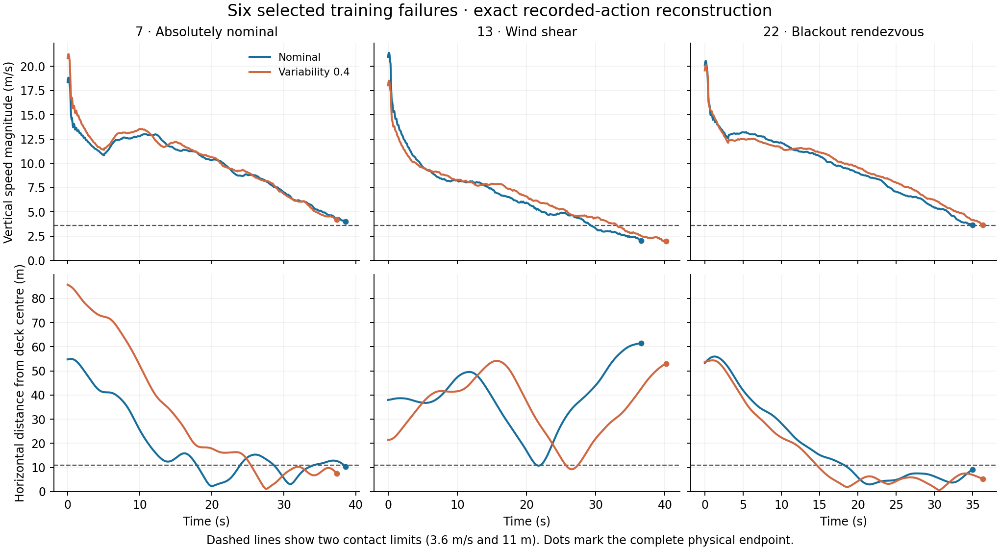

# Six training failures: exact physical diagnosis

All six unchanged-controller neural traces reproduce their original training endpoints. Replaying their recorded actions also matches every recorded decision state, every presented cue and every complete endpoint exactly: **1,494 decisions and 4,479 physical steps**. All six flights remain failures. The actual three-engine bank engages within **0.35–0.45 seconds**, and **72.9–76.5% fuel remains** at contact. These cases do not show a failure to request or engage the bank, or fuel exhaustion.

The cohort contains the preselected nominal and variability-0.4 training failures on missions 7, 13 and 22. It was chosen from training evidence before the completed selection was read. The frozen generation-six controller, sensory basis, full-network worker and physical rules are unchanged. These six training cases do not qualify a replacement for the release or reverse the [rejected all-ground selection](ground-all-selection.md).

The engine-fault cases reach the deck before slowing below the vertical-speed limit. The wind-shear cases briefly approach the deck centre, then move far outside its radius before contact. Their position error is therefore a trajectory problem, not just a final offset. The plotted thresholds apply at contact; landing also requires the lateral-speed, tilt and yaw-rate limits.

| Mission | Variability | Deck error (m) | Vertical speed (m/s) | Lateral speed (m/s) | Tilt (rad) | Failed contact bounds |
| --- | ---: | ---: | ---: | ---: | ---: | --- |
| 7 | 0 | 10.228 | 4.010 | 3.498 | 0.148 | vertical speed, lateral speed |
| 7 | 0.4 | 7.506 | 4.189 | 4.574 | 0.192 | vertical speed, lateral speed |
| 13 | 0 | 61.599 | 2.054 | 1.047 | 0.196 | position |
| 13 | 0.4 | 53.058 | 1.982 | 2.468 | 0.222 | position, tilt |
| 22 | 0 | 9.097 | 3.663 | 2.079 | 0.105 | vertical speed |
| 22 | 0.4 | 5.313 | 3.644 | 3.764 | 0.050 | vertical speed, lateral speed |

Successful contact requires deck error below 11 m, vertical speed below 3.6 m/s, lateral speed below 3 m/s, tilt below 0.2 rad and absolute yaw rate below 0.3 rad/s. The reconstructed terminal yaw rates pass that last bound in all six cases. Full precision and the original reason-priority labels remain in the result file.

| Mission | Variability | Bank 3 first applied, step end (s) | Engine fault first applied, step end (s) | Fuel at contact | Applied throttle range, final 5 s |
| --- | ---: | ---: | ---: | ---: | ---: |
| 7 | 0 | 0.40 | 5.10 | 74.3% | 24.3–27.3% |
| 7 | 0.4 | 0.35 | 5.10 | 74.5% | 24.2–27.8% |
| 13 | 0 | 0.40 | None | 74.6% | 14.8–17.2% |
| 13 | 0.4 | 0.45 | None | 72.9% | 14.2–17.1% |
| 22 | 0 | 0.40 | 3.10 | 76.5% | 23.9–27.4% |
| 22 | 0.4 | 0.45 | 3.10 | 75.4% | 24.6–27.5% |

All 1,494 decisions request bank 3 from time zero. Each physical selector switches the bank exactly once. In the four engine-fault cases, that switch precedes the failure; mission 13 has no engine fault. Times above are the ends of the first affected 50 ms steps; their exact start/end intervals are retained. The engine-fault cases apply roughly 24–28% throttle in the final five seconds and still descend too quickly at contact. Available fuel and unused throttle range support investigating the learned braking behavior, but do not prove that any chosen replacement action would land.

The frozen vertical-acceleration equation agrees with the reconstructed velocity changes within **3.56e-14 m/s²**, using fuel before burn, attitude before the step and the newly applied actuator/fault state. Recombining decoded cue contributions for the seven inspected output heads agrees with all 10,458 recorded commands within **6.57e-12**. This is numerical agreement of the combined readout; it does not establish exact causal effects of individual cues. Arithmetic using presented values is explicitly an offline comparison and was never executed as a control action.

The original training run did not record trajectories. Exact state and cue comparisons therefore use the new unchanged-worker traces, while every final endpoint is also compared with the original training record. The new runtime pins 71 files; it cannot retrospectively certify the three transitive imports missing from the historical training archive. No new evaluation cohort, parameter fitting, physical-rule change, earlier-candidate substitution or deployment is part of this diagnosis.

The [full diagnostic summary](ground-training-diagnostic-results.json) includes all six original endpoints, reconstructed terminal states, timing intervals, source hashes and numerical discrepancies. The [decision CSV](ground-training-diagnostic-decisions.csv) preserves every pre-decision record; its applied actuator values precede that row’s newly requested action. Full per-step and cue-contribution JSONL records remain in the local diagnostic archive. Regenerate these report artifacts with `artifacts/lif-runtime/bin/python scripts/report-ground-training-diagnostic.py`; this reads the completed records without running flights.
