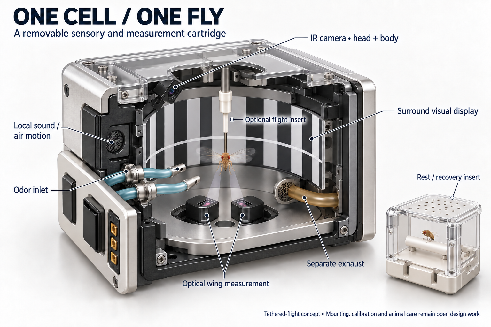
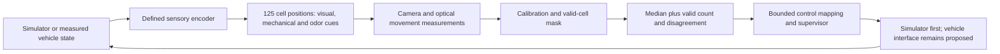
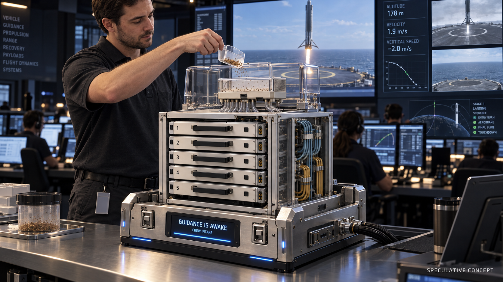

# Fly Cube: a physical harness concept

**A cube with 125 individually instrumented cells, organized as five removable
trays of 25.** The command cradle supplies services and receives a shared
behavioral control signal. These are design mock-ups, not photographs of
existing hardware or evidence that living flies can land a vehicle.

The current priority is to take simulated-fly training as far as possible
through the mission curriculum **before building physical Fly Cube boxes**.
This document preserves the hardware idea for that later stage.

## The cube

Each tray follows a 5 × 5 cell layout. A replaceable cell cartridge would hold
one fly, its sensory surround and optical access. Per-cell cameras serve
occupancy and movement tracking; the base collects measurements. Shared
services run behind the trays so individual cartridges can be inspected,
cleaned and replaced.

The top cassette represents a gentle, enclosed loading route: a holding
compartment, camera-checked single-animal gate and distribution passages into
individual holding positions. Gate operation would need reliable occupancy
checks, escape containment and a way to stop and recover a misrouted animal.
The drawings propose that mechanism; they do not establish its operation.

**Sorting a fly into a cell does not establish a flight mount.** The detailed
cell below uses an optional tethered-flight insert. The transition from a
casually loaded loose fly to a reproducible flight-measurement position is
unresolved. Initial physical work could use separately prepared inserts. A
fully automatic scoop-to-flight system would need to solve this additional
problem. Free-flight tracking is another research direction, with different
space, visibility and behavioral constraints; it is not interchangeable with
the pictured tethered measurement.

## One cell

| Part | Proposed role | What still needs measurement |
| --- | --- | --- |
| IR camera | Track the head and body; confirm occupancy and tracking quality | Useful view, resolution, illumination, latency and sustained tracking |
| Optical wing readout | Measure left/right wing-stroke signals alongside the camera | Calibration, occlusion and how the measured signal maps to movement |
| Surround display | Present optic flow, horizon and task cues | View coverage, contrast, spectrum, refresh and end-to-end delay |
| Local sound / air motion | Present a separately controlled mechanical cue | The actual motion at the antennae and leakage into adjacent cells |
| Odor inlet and separate exhaust | Present and clear reproducible chemical stimuli | Concentration at the animal, timing, carryover, flow and cross-contamination |
| Replaceable flight / rest inserts | Allow inspection, recovery and different experimental modes | Preparation, handling, flight duration, access and animal-care requirements |

The camera and wing analyzer are complementary. Published tethered-flight
apparatus has combined a camera for head motion with infrared optical
wing-stroke measurements and a surrounding visual display. This supports the
component arrangement; it does not validate miniaturizing 125 copies into
this cube. [Duistermars, Care and Frye, 2012](https://www.frontiersin.org/journals/behavioral-neuroscience/articles/10.3389/fnbeh.2012.00006/full).

The sum and difference of wing amplitudes are useful experimental proxies,
but a two-dimensional optical projection does not recover complete
three-dimensional flight kinematics or independently provide every ship
command. A physical mapping should begin with a small number of measured
control dimensions. [Theobald, Ringach and Frye, 2010](https://pmc.ncbi.nlm.nih.gov/articles/PMC2846167/).

“Audio” needs its own calibration: fly antennal hearing experiments quantify
local particle velocity. A speaker's nominal electrical setting is therefore
insufficient to specify the stimulus received by the fly.
[Clemens et al., 2018](https://www.nature.com/articles/s41467-017-02453-9).

The cutaway leaves access for these systems rather than promising a perfectly
uninterrupted visual sphere. Component placement, illustrated light cones,
tube routing and clearances are explanatory; they are not an optical design,
flow simulation or manufacturing drawing. Exact dimensions and operating
rates remain unspecified.

## What the cube would contribute

The simplest starting aggregate is a **component-wise median of valid,
individually calibrated movement measurements**. For example, each fly could
contribute a baseline-corrected wing-asymmetry signal. Camera tracking would
identify missing, occluded, stale or inactive measurements; these cells would
be absent from that update rather than counted as a zero command.

Calibration must establish a consistent scale and meaning for the chosen
signal. Exclusion criteria should concern measurement validity, not whether
a fly agrees with the desired direction. Record the individual measurements,
the number of valid cells and their spread alongside the median. A small
amount of bounded temporal smoothing is a testable next step if needed.

Averaging many flies does not automatically remove shared stimulus errors,
measurement bias or a common ineffective response. The supervisor would need
a tested rule for excessive disagreement, stale data or too few active cells,
including handing control back to an independently validated controller.
There is no proposed direct connection from the sensory encoder to actuators;
the fly contribution must be measured separately from any computation in
that encoder.

This is an ensemble of measured behavior, not access to 125 brains' neural
votes. Nor does the chosen median establish that an ensemble improves
control. That comparison belongs in a small controlled experiment before
increasing the cell count.

## The command-center scene

The intended joke is the ordinary scoop against the solemn landing screens:
**GUIDANCE IS AWAKE.** The cradle gives the cube a believable home with
alignment rails, latches, a services connection and a status display. The
scene is explicitly labeled speculative and is not a depiction of a real
SpaceX installation. The scoop gesture dramatizes loading; the enclosed
transfer interface and the sorting-to-flight-mount handoff still need design.

## Current evidence and next physical question

The project has simulated flight results, but no tested living-fly harness.
The [physical-interface note](physical-fly-interface.md) separates model output
from measured biology. The [148-trial additional odor panel](additional-odor-tests.md)
found no candidate that qualified for steering follow-up. The subsequent
[68-trial calibration study](odor-calibration-followup.md) eliminated recorded
motor spikes at its lower connection weight. Neither establishes a physical
chemical steering channel.

When physical work begins, start by establishing a repeatable, useful movement readout in **one cell**,
with a fixed visual task and calibrated timing. A small tray could then test
whether independent measurements can be collected without optical, airflow,
acoustic or thermal interference, and whether the aggregate adds value.
Only those results can justify 125-cell packaging. Automatic loading,
mounting, animal care and recovery remain explicit workstreams.

## Image provenance

Generated on 13 September 2026 with the built-in ImageGen tool. The final
chamber includes a targeted edit to aim the camera toward the fly. The three
selected PNGs were visually inspected and copied into this repository with
source/destination SHA-256 equality checked. The exterior and chamber are
1536 × 1024 pixels; the mission-control scene is 1672 × 941 pixels.

The complete generation prompts, camera-correction prompt and original
output paths are retained in
[the prompt record](assets/harness-concept-prompts.json). No flight code,
controller, checkpoint, experiment result or deployed site was changed by
this concept study.
