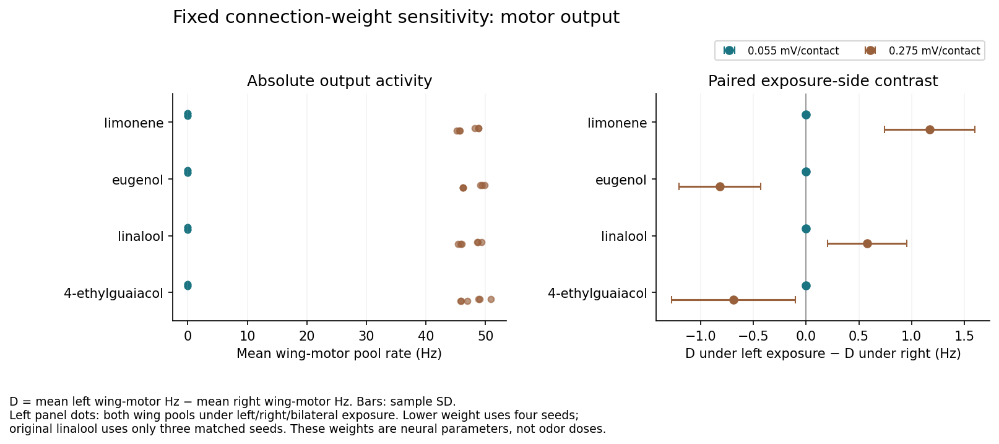
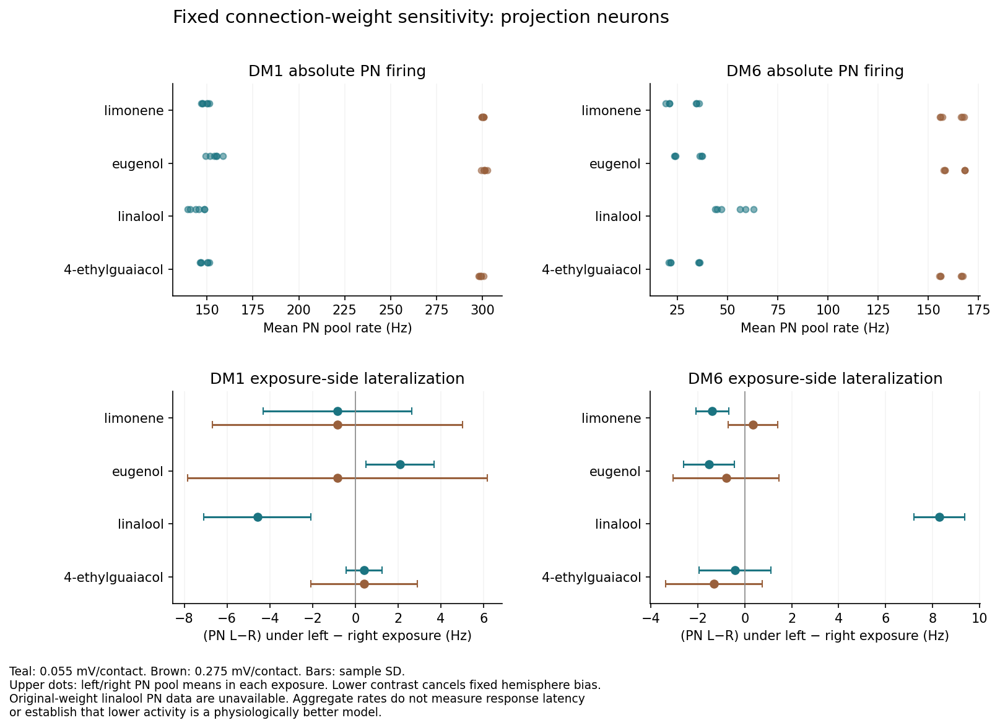

# Chemical responses depend strongly on circuit calibration

**The fixed 68-trial follow-up reduced projection-neuron firing but eliminated
recorded motor output at the lower connection weight.** All 52 trials at
0.055 mV/contact had zero spikes in the wing and three leg-motor pools. This
does not establish a better model or a usable chemical interface. The
transferred dynamics still limit how chemical-response results can be
interpreted.

## Fixed experiment

The unchanged whole-graph `lif-odor-probe.py` tested limonene, eugenol,
linalool and 4-ethylguaiacol at the already available diagnostic setting of
**0.055 mV/contact**. Each chemical received left-only, right-only and
bilateral exposure on four fixed seeds, with four shared clean-air controls:
52 trials. A further 16 trials supplied the missing original-weight
4-ethylguaiacol reference at **0.275 mV/contact**.

Both blocks retained **166,700 neurons and 25,582,938 directed connections**.
Seeds were 370019, 377938, 385857 and 393776, with 0.2 s of spontaneous
prewarm and a 0.6 s observation window. The time step, LIF equations,
transmitter signs, delays, receptor mapping and source drive were unchanged.
In particular, the source Poisson scale stayed at 150 Hz and its external
pulse stayed at 68.75 mV. Only the coefficient applied to every graph
connection changed to one fifth of its original value.

**A synaptic weight is not an odor dose.** This is a model-sensitivity assay,
with no parameter search, decoder fit or biological calibration. The
underlying parameters were transferred from the
[Shiu et al. model](https://doi.org/10.1038/s41586-024-07763-9), rather than
fitted to the MaleCNS olfactory and wing-motor circuit. Normalized
[DoOR profiles](https://github.com/ropensci/DoOR.data/tree/db323a496577c4b4a72b5c2fcd1859e07521ffb5)
remain assumed Poisson drives, with unknown responses retaining the matched
spontaneous reference. The four candidates have 23, 29, 29 and 22 measured
mapped units, respectively. Derived DoOR material retains CC BY-SA 4.0
attribution to its contributors.

## Matched original-weight references

Limonene and eugenol use the four original seeds from the
[additional chemical panel](additional-odor-tests.md). Linalool uses only
its **three** matching seeds from the older expanded panel: 370019, 377938
and 385857. Its missing fourth original-weight trial was not inferred.
That older record contains **no PN measurements**, so no original-weight
linalool PN comparison is made.

The comparison verifies the atlas hash, all recorded neural parameters,
observation duration and intersecting seed identities. The archived and
current scripts have identical graph-loading and model-building function
ASTs; source review confirms that the odor-mode drive is unchanged. The
new original-weight clean-air block exactly reproduced all shared numerical
fields in the four newer and three older clean-air records. Missing PN
fields remain missing. This is evidence for computational comparability,
not biological validity.

## Absolute firing and baseline bias

Values below are mean ± sample SD across four seeds. Pool rates are averaged
per neuron before comparison. DM1 contains one measured PN in each
hemisphere; DM6 contains three left and four right PNs. The wing-motor pools
contain 33 left and 34 right neurons.

| Clean-air measurement | 0.275 mV/contact | 0.055 mV/contact |
| --- | ---: | ---: |
| Left wing-motor pool, Hz | 48.801 ± 1.148 | 0 |
| Right wing-motor pool, Hz | 45.600 ± 0.948 | 0 |
| DM1 PN left / right, Hz | 299.167 ± 1.667 / 298.333 ± 1.361 | 151.667 ± 1.361 / 146.250 ± 1.596 |
| DM6 PN left / right, Hz | 157.083 ± 1.530 / 167.083 ± 0.761 | 23.611 ± 0.717 / 36.354 ± 0.399 |

The lower-weight clean-air graph still produced about **50,811 spikes** and
had **2,788 active neurons** per observation, averaged across seeds, compared
with 747,848 spikes and 17,731 active neurons at the original weight. Thus,
the absence of motor spikes occurs alongside ongoing sensory and recurrent
activity. All graph neurons still compute.

The lower coefficient reduces the previously observed high PN rates, but
does not establish that physiological saturation has been corrected. Even
without an odor pulse, DM1 retains a left-minus-right bias of **+5.417 ±
1.596 Hz**, and DM6 a bias of **−12.743 ± 1.029 Hz**. A larger raw difference
between hemispheres is therefore not evidence of stronger odor
lateralization. Aggregate counts also cannot measure response latency or
a neuron's saturation curve.

## Chemical changes after subtracting clean air

Let **D = mean left wing-motor Hz − mean right wing-motor Hz**. Each chemical
effect subtracts its same-seed clean-air D. The directional contrast is D
under left exposure minus D under right exposure. Values below describe the
original 0.275 mV/contact model; uncertainty is sample SD. Linalool uses
three seeds and the other compounds four.

| Compound | Left − air, Hz | Right − air, Hz | Bilateral − air, Hz | Left − right exposure, Hz |
| --- | ---: | ---: | ---: | ---: |
| Limonene | +0.441 ± 0.265 | −0.730 ± 0.548 | −0.025 ± 0.631 | +1.171 ± 0.427 |
| Eugenol | −0.346 ± 0.163 | +0.472 ± 0.392 | +0.081 ± 0.451 | −0.818 ± 0.388 |
| Linalool | +0.144 ± 0.566 | −0.434 ± 0.493 | +0.143 ± 0.485 | +0.578 ± 0.376 |
| 4-ethylguaiacol | +0.044 ± 0.974 | +0.736 ± 0.616 | −0.268 ± 0.440 | −0.692 ± 0.587 |

At **0.055 mV/contact, every motor value, clean-air-subtracted effect and
exposure-side contrast was exactly zero in the observed windows**. These
zero-count observations are not estimates of biological silence. The
portable results include paired cross-weight differences computed on
matching seeds only. Linalool's cross-weight comparison uses the same three
seeds on both sides, while its separately reported lower-weight results
retain all four new seeds.

The new 4-ethylguaiacol original-weight directional contrast has a nominal
95% interval of **−1.626 to +0.242 Hz**, spanning zero. Limonene's reused
four-seed signal must still be read alongside its
[failed independent eight-seed replication](additional-odor-tests.md#independent-limonene-confirmation).
No new steering trial or model selection was performed here.



## PN responses remain asymmetric and task-limited

For a PN population, the exposure-side contrast is its left-minus-right
pool rate under left exposure minus that under right exposure. This
cancels the fixed clean-air hemisphere difference. At the lower weight,
linalool's DM6 contrast was **+8.299 ± 1.084 Hz**, with nominal 95% interval
**+6.574 to +10.024 Hz**; all four seed contrasts were positive. Its DM1
contrast had the opposite sign: **−4.583 ± 2.500 Hz**.

The DM6 contrast is not a symmetric ipsilateral advantage for both antennae.
After clean-air subtraction, left-only linalool increased the ipsilateral
minus contralateral difference by **+9.722 ± 1.526 Hz**, while right-only
delivery changed it by **−1.424 ± 1.454 Hz**. The corresponding raw DM6
left/right rates were 43.750/46.771 Hz under left exposure and
44.722/56.042 Hz under right exposure. These values show why baseline
subtraction and both stimulus sides matter.

This is a stimulus-dependent PN response inside the model, accompanied by
zero recorded motor output. It does not demonstrate bilateral sensory
calibration or a path to physical movement. Original-weight linalool PN
data are unavailable, so this response cannot be attributed quantitatively
to the weight change. All other PN rates, paired clean-air changes and
matched cross-weight comparisons are retained in the
[compact results](additional-calibration-results.json).



All reported intervals are nominal paired Student-t 95% intervals, assume
approximately normal seed contrasts, and are uncorrected across these
descriptive comparisons. Three or four simulation seeds are not independent
animals. The outcomes establish sensitivity to a global neural parameter;
they do not identify a validated weight, odor dose or useful motor response.
Circuit calibration continues to limit chemical interpretation.

## Reproduction and verification

The 68 new trials completed without execution failures, taking **258.1
seconds** of measured trial time, excluding input verification and graph
setup. Full raw records, protocol and source hashes remain under
`artifacts/odor-interface/additional-calibration-*`. The repository includes
the compact results and both figures.

```sh
artifacts/lif-runtime/bin/python scripts/additional-calibration.py
artifacts/lif-runtime/bin/python scripts/additional-calibration-summary.py --export-docs
```

The runner refuses to overwrite existing reports. Use another
`--prefix additional-calibration-rerun` on both commands to retain a fresh
run separately. With completed trials already available, the second command
alone validates and regenerates the results without running a neural
simulation. It checks input hashes, report completion, shared protocol,
source-rate equality, matched seeds and exact clean-air reproduction, then
verifies exported JSON/PNG hashes against the artifact copies.

The browser model, flight checkpoint and original neural assay were not
modified by this experiment.
