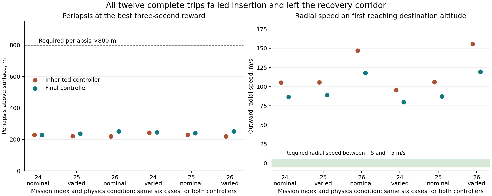

# Paired orbital diagnostic: inherited and final controllers

The final controller improves the shaping reward on all six paired development cases, while every original trip still exits the recovery corridor. Both controllers have **zero seconds satisfying the actual insertion predicate**, zero stable-orbit milestones, zero completed orbits, and zero landings. The improved reward therefore does not establish insertion.

The audit retains all twelve complete trips. It uses only their recorded actions in frozen physics and recorded decoded values in arithmetic decompositions. It performs no neural inference, new learned flight, coefficient replacement, fit, threshold change, guidance run, intervention, or selection.

## Verification and provenance

All 8,240 recorded decisions and 23,225 original physical steps were retained. All 57,680 stored physical-state scalars, all 230,720 presented panel/body values, and all twelve original endpoints match exactly. The three reconstructed heads account for 24,720 commands; their maximum absolute error is 1.05e-11, below the predeclared 1e-10 tolerance. The independently integrated hold quality differs from the recorded result by at most 1.83e-15; the corresponding reward differs by at most 2.16e-12.

The six case identities, model vectors, frozen model files, basis, transitive runtime modules, graph files, and native build/binary were checked. Probe hashes also match the parent’s terminal completion checks. Every tracked input remained unchanged. The snapshot attests these new paired probes; it does not retroactively certify every dependency used during preceding training.

The recorded-action audit was repeated once after static review corrected a zero-quality peak-report edge case and labeled the separate archived proxy value. All numerical results and preexisting event records were exactly unchanged. The first source, manifest and summary are preserved in `attempt-1/`, with both successful execution logs. No new controller evaluations were run.

The [machine-readable paired report](orbital-joint-paired-results.json) contains
all twelve endpoints, physical events, constraint summaries, paired metrics and
source identities. The full decision and step records remain in the experiment archive.

## All paired outcomes

Cases use the fixed order below. Variability is dimensionless. All endpoint reasons are “Flight left the recovery corridor”; every actual qualifying hold is 0 s. Hold quality is the best three-second rolling mean of the deficit-based reward, not a success rate.

| Case | Scenario / seed / variability | Decisions initial → final | Duration s initial → final | Hold quality initial → final | Fitness initial → final | Fuel left initial → final |
|---|---|---:|---:|---:|---:|---:|
| 1 | 24 / 714133 / 0 | 567 → 720 | 125.05 → 154.15 | 0.04536 → 0.05183 | 206.467 → 213.824 | 0.15229 → 0.07239 |
| 2 | 25 / 733800 / 0.4 | 552 → 676 | 121.60 → 147.80 | 0.04280 → 0.04936 | 203.375 → 211.002 | 0.18120 → 0.11861 |
| 3 | 26 / 753467 / 0 | 753 → 799 | 150.20 → 168.10 | 0.03858 → 0.04673 | 197.764 → 207.565 | 0.00000 → 0.00000 |
| 4 | 24 / 773134 / 0.4 | 598 → 775 | 132.90 → 167.30 | 0.04007 → 0.05199 | 199.908 → 214.349 | 0.09727 → 0.00388 |
| 5 | 25 / 792801 / 0 | 577 → 715 | 126.05 → 154.85 | 0.04163 → 0.04903 | 202.019 → 210.883 | 0.14270 → 0.07419 |
| 6 | 26 / 812468 / 0.4 | 713 → 795 | 143.20 → 165.65 | 0.03582 → 0.03832 | 194.687 → 197.656 | 0.00000 → 0.00000 |

Mean hold quality increases **0.0407093 → 0.0478759**, and mean outcome fitness **200.703 → 209.213**. Every trip reaches the maximum 200-point altitude shaping bonus. Mean physical outcome score slightly worsens, by 0.898 points; the mean 8.510 fitness increase comes from the hold shaping term. Each final trip lasts 17.90–34.40 s longer.

## Pitch timing and physical insertion deficit

Every final trip first reaches positive raw pitch 45° earlier and at a lower physical altitude: 3.55–4.90 s earlier and 20.51–32.03 m lower. Every final trip reaches 80° later, also at a lower altitude: 7.45–20.30 s later and 3.78–34.61 m lower. The final trajectory combines an earlier initial pitch-over with slower progression to 80°.

| Case | 45° time s initial → final | 45° altitude m initial → final | 80° time s initial → final | 80° altitude m initial → final | Destination time s initial → final |
|---|---:|---:|---:|---:|---:|
| 1 | 20.05 → 16.50 | 129.43 → 108.91 | 44.10 → 60.40 | 195.27 → 191.49 | 87.80 → 109.15 |
| 2 | 19.25 → 15.00 | 136.21 → 104.18 | 41.45 → 48.90 | 198.93 → 164.31 | 84.35 → 103.30 |
| 3 | 18.50 → 14.75 | 124.11 → 100.55 | 43.70 → 64.00 | 180.35 → 168.64 | 118.20 → 127.35 |
| 4 | 22.45 → 17.55 | 124.66 → 101.23 | 55.00 → 70.85 | 196.81 → 185.88 | 93.15 → 119.05 |
| 5 | 19.85 → 16.20 | 128.04 → 105.95 | 47.35 → 55.05 | 199.38 → 171.94 | 89.05 → 109.60 |
| 6 | 17.45 → 13.70 | 128.27 → 101.31 | 39.80 → 54.20 | 178.60 → 164.80 | 112.70 → 125.40 |

The physical insertion condition is periapsis >800 m, apoapsis within 200 m of destination, and |vertical speed| <5 m/s, simultaneously. It was evaluated after every original step independently of the simulator’s phase-gated hold counter. When apoapsis and vertical speed both satisfy their limits, the greatest periapsis reached in any initial trip is 235.65 m and in any final trip 247.23 m. None is close to the required periapsis. The first periapsis >800 m step in every trip is already unbound, with infinite apoapsis and large vertical speed.

At the final controller’s rolling-reward peaks, periapsis is only 227.99–251.17 m and physical altitude 232.29–267.51 m. The first destination-altitude crossings occur 9.15–25.90 s later than the inherited controller; all twelve destination crossings are already unbound. The final controller crosses with vertical speed 79.85–119.52 m/s, versus 95.59–155.69 m/s initially. All original corridor endpoints are preserved, at approximately 12 km altitude.

## Requested commands, realized actuators and fuel

Requested throttle is `(action[0]+1)/2`. Realized throttle uses the original servo and fuel interlock. Complete-trip and after-destination means use exact time overlaps; physical means use post-step actuator values over their original physical intervals. The following are unweighted means of the six case-specific time means.

| Quantity | Initial | Final |
|---|---:|---:|
| Complete-trip requested throttle | 0.585384 | 0.504296 |
| Complete-trip realized throttle | 0.566036 | 0.498668 |
| After-destination requested throttle | 0.535748 | 0.295639 |
| After-destination realized throttle | 0.445963 | 0.272976 |
| Fuel remaining at destination | 0.289679 | 0.189858 |
| Fuel remaining at original endpoint | 0.095575 | 0.044845 |

Every initial trip requests throttle ≥0.45 throughout its entire after-destination interval. No final trip requests ≥0.45 during that interval; its case-specific requested mean is 0.28665–0.30564. Neither controller requests below 0.1 there. Final time below 0.25 is 9.20% in case 3, 0.52% in case 4, and 0% in the others. Two scenario-26 trips per controller exhaust fuel; their actual throttle falls to zero while requested throttle remains positive. Lower final mean throttle coexists with a longer trip, more fuel spent before destination, and less fuel remaining.

## What the three head decompositions show

Every original decision includes all direction and bias terms for throttle, pitch gimbal and pitch RCS, their decoded/presented values, logits, commands and numerical errors. Contributions add before `tanh`. Each event also preserves both the command applied immediately before it and the decision at or before its timestamp. These are different records when a new decision occurs exactly at an event.

At first destination crossing, the across-case mean throttle logit changes **+0.04773 → −0.36251**. The travel-direction contribution changes **+0.01011 → −0.54794**, and vertical-speed contribution **−0.58765 → −0.70888**. Other terms partially offset these changes, including destination **+0.85984 → +0.92483** and tangent speed **+0.34323 → +0.41127**. Direction 22’s frozen coefficient changes +0.04330 → −2.04249. This arithmetic explains how the recorded lower late throttle is assembled; it is not an isolated coefficient intervention or a demonstration that one coefficient caused the outcome.

Pitch-gimbal’s mean command immediately before first 80° increases **0.22728 → 0.30060**; its pitch contribution increases **0.16830 → 0.24823**. Pitch-RCS at that event contains strongly opposing terms: the final mean pitch contribution is −2.70435, destination +2.52068, tangent speed +1.29170, and drift −0.86913, with all other terms retained in the tables. Their net mean logit is only +0.05397. Near-cancellation makes it misleading to interpret a single contribution as the command. Positive pitch gimbal and positive pitch RCS also create opposite direct pitch-torque signs in the frozen dynamics.

The displayed-value arithmetic comparison gives a final mean pitch-RCS logit of −0.06515 at first 80°, versus the recorded-decoded +0.05397. This identifies sensitivity to decoded readout error within the existing sum; it is not a simulated flight using alternate inputs. No displayed or decoded value was substituted into the actual replay.

## Retained evidence and limits

`manifest.json` contains input hashes, runtime checks, assertions, source digests, conventions and limitations. `summary.json`, `all-cases.csv` and `paired-differences.csv` retain every case and pairing. `constraint-summary.json` contains independent conditional insertion checks. `all-decisions.jsonl` retains all 8,240 decisions with full head/term detail; `all-physical-steps.jsonl` retains all 23,225 steps and deficits. Equivalent CSV views, event contribution tables and all 28 parameter differences are supplied. Deterministically compressed full-row copies are available for archiving.

Times are simulated seconds and distances are the simulator’s sandbox meters; physical altitude is y−8. Nonfinite orbital values are explicit strings such as `Infinity`; absent events are separately marked. The six paired cases are development diagnostics, not a held-out reliability evaluation. The evidence supports a coupled trajectory/control failure and modest shaping-reward improvement; it does not validate insertion or establish the result of any new training experiment.
