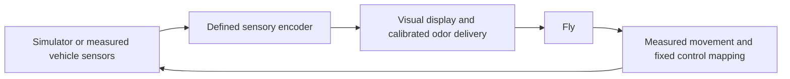
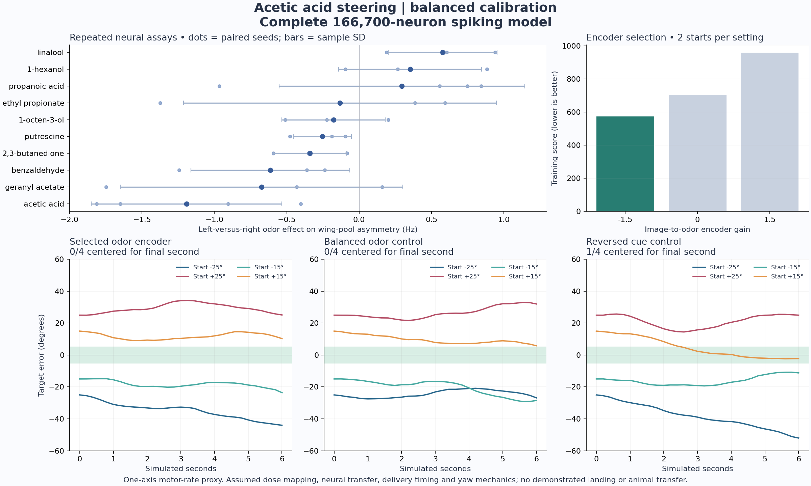

# A physically testable fly interface

The goal is to find a sensory interface that could be implemented around a living fly and support safe simulated landings, eventually across all 27 missions. A successful numerical policy is useful evidence about that policy. Transfer to a living fly requires independently measured stimulus and movement responses.

A subsequent [mission curriculum](suite-training.md) has produced 28/32 safe
simulated touchdowns across four missions using twelve visible measurements
and an externally learned throttle, steering and stabilization decoder.
Matched covered-eye and disabled-indicator controls each landed 0/32. Its
separate frozen-checkpoint report records every failure. These visual-control
results do not validate chemical steering or transfer to a living fly; the
odor experiments below remain negative or inconclusive for those questions.

The proposed loop is:



The stimulus generator has no direct actuator connection. Its inputs and computation must be documented. If it computes an entire flight policy and encodes desired actions as odors, that demonstrates fly-mediated control. Demonstrating that the fly learns flight control requires restricting the encoder to presenting sensory information and testing the fly's contribution separately.

Parts of this apparatus are established. Tethered flies have controlled visual flight simulators, and conditioned visual orientation has been demonstrated, with substantial variation between animals ([Guo et al., 1996](https://doi.org/10.1101/lm.3.1.49)). An attractive odor changed aerodynamic power and optomotor responses in tethered-flight experiments; its effects depended on the visual context ([Chow and Frye, 2008](https://pubmed.ncbi.nlm.nih.gov/18626082/)). These results support an experimental interface, not a prediction of rocket-landing competence.

## What the shipped flight model currently tests

The complete anatomical graph participates in every model decision. Its activity dynamics, sensory tuning and external output decoder are still simplified or authored. In particular:

| Layer | Current implementation | Evidence needed for transfer |
| --- | --- | --- |
| Odor stimulus | Four normalized left/right inputs for two odors | Delivered concentration and timing at each antenna; full receptor response profiles, adaptation and mixture interactions |
| Neural dynamics | Two recurrent signed rate updates per decision | Empirical dynamics and timing; appropriate receptor and transmitter physiology |
| Body feedback | Authored mapping of rotation, loads and control positions | Physical presentation and measured sensory responses |
| Movement output | 21,300 fitted weights decode 2,129 neural activities into ten commands | A practical measurement of fly movement and a defined mapping to controls |
| Learning | Numerical search or regression changes the external decoder | Distinguish decoder adaptation, stimulus optimization and learning within the animal |

The current treatment of histamine and unknown transmitters as excitatory is a documented model limitation, particularly relevant to visual physiology. The displayed limb motion follows commands through inverse kinematics; it is not a validated prediction of biological muscles. Increasing global circuit gain is not a modeled chemical dose. These gaps prevent assigning physical concentrations or expected animal behavior to an optimized software setting.

## Initial chemical candidates

Ethyl acetate and geosmin are reasonable *assay starting points* because the application already contains their annotated sensory routes. They are external odorants; they are not interchangeable with pheromones or internal neuromodulators.

| Candidate | Biological evidence | Interpretation for this project |
| --- | --- | --- |
| Ethyl acetate | Responses in Or42b / DM1 are experimentally documented ([Paoli et al., 2017](https://pubmed.ncbi.nlm.nih.gov/28670618/)). | A receptor-response probe. The current DM1-only routing is an incomplete odor representation and does not establish a reward signal. |
| Geosmin | Or56a / DA2 mediates a specific aversive pathway in the reported experiments ([Stensmyr et al., 2012](https://doi.org/10.1016/j.cell.2012.09.046)). | A selective probe. Avoidance does not specify a useful braking, steering or landing command. |

A larger panel should be selected using measured response patterns, not assigned meanings such as “left odor” and “brake odor.” [DoOR 2.0](https://www.nature.com/articles/srep21841) provides a consensus odor-response matrix; its normalized values are not universal concentration-response curves. The [DoOR maintainers](https://neuro.uni-konstanz.de/DoOR/content/DoOR.php) also point to a [2025 anatomical and functional mapping resource](https://doi.org/10.1038/s44319-025-00476-8). Receptor overlap, uncertainty and unmeasured entries must remain visible when using these data.

Odor timing deserves measurement rather than an assumption that it is always slow. Flies distinguished 33 ms onset differences in an odor-mixture experiment ([Sehdev et al., 2019](https://doi.org/10.1016/j.isci.2019.02.014)). That result does not specify the latency of this apparatus or a motor response. Delivery delay, clearance, cross-contamination and adaptation need calibration for the actual setup.

## Evidence collected on 13 September 2026

The earlier visual-orientation checkpoint completed **0 of 54 flights successfully**: two deterministic evaluation seeds for each of 27 missions, one nominal and one with variability 0.4. Style was disabled. This is a small historical baseline screen, not an estimate of the later landing checkpoint's reliability. It used retinal pixels, body signals and the existing automatic odor release. The instrument-trained reference supplied no actions.

The paired odor assay holds the checkpoint, retinal image, body input and pre-pulse network state fixed. It compares clean air with unilateral and bilateral ethyl acetate or geosmin at two normalized levels in three initial visual contexts. It includes 12 prewarm decisions, 12 pulse decisions and 20 washout decisions. Every decision computes the full graph twice. The largest absolute command change was approximately **0.020735**, on a command scale from −1 to +1. This establishes sensitivity in the model under those conditions, not biological responsiveness or sufficient control authority for landing.

The separate sustained-odor search tested all 16 binary settings of the four existing channels on three training seeds: **0 safe landings in 48 training flights**. It selected by landings and then mean reward, and evaluated the selected setting, clean air and the shipped odor rule on four separate validation seeds. All three conditions scored **0 of 4 safe landings**. The selected setting had mean reward −1020.532 versus −1020.728 for clean air, a small reward change with no demonstrated landing benefit. The decoder remained fixed. These results do not identify a working chemical control program, nor do they show that another model or a living fly could not benefit from odors.

Reproduce the experiments from the repository root:

```sh
node scripts/evaluate-embodied.mjs
node scripts/assay-odors.mjs
node scripts/search-odor-settings.mjs
```

All results, seeds, checkpoint hashes and failures from these odor assays are retained under `artifacts/embodied-training/`. The evaluation writes partial progress atomically. Those assays did not overwrite the flight checkpoint or change the live application.

## Expanded chemistry and a separate spiking experiment

The offline atlas now joins **689 odorants** from the pinned [DoOR.data source](https://github.com/ropensci/DoOR.data/tree/db323a496577c4b4a72b5c2fcd1859e07521ffb5) to **49 annotated olfactory units and 2,141 left/right ORNs**. Another 397 associated ORNs lack known laterality and receive no direct stimulus in these assays. All remain in the neural graph. Missing response measurements remain missing; co-expressed receptor profiles are not counted twice. The builder verifies annotation IDs against every retained graph neuron. The derived atlas retains DoOR's [CC BY-SA 4.0](https://creativecommons.org/licenses/by-sa/4.0/) license and attribution.

Directly stimulated ORNs are unevenly represented: **855 left and 1,286 right**. Of the 397 unknown-side records, 359 have annotations describing a half axon or an axon confined to one antennal lobe, and 360 are marked hard to trace. Most ORNs project bilaterally, so locating a fragment in one lobe does not identify its antenna of origin. Assigning these cells a side from their centroid would therefore be unsupported. This input imbalance is a possible contributor to steering bias, not an established explanation of the failed control tests. The anatomical audit is retained in `artifacts/odor-interface/orn-pn-laterality.json`.

Published physiology provides a useful intermediate validation target: lateralized odor produced stronger and earlier responses in ipsilateral projection neurons, with an asymmetry in ORN synaptic output ([Gaudry et al., 2013](https://doi.org/10.1038/nature11747)). Our contact-count audit already finds asymmetric ORN-to-PN connectivity in DM1 and DM6. A uniform additional lateral gain could count the anatomical asymmetry twice. The model needs a measured PN-response comparison before adding such a correction; no compensatory gain or inferred antenna labels were applied here.

A fixed-readout screen tested 153 odorants with at least 20 measured unit responses. The inherited rate model attenuated their effects on the anatomical wing-motor pools to roughly 10⁻⁸ activity units. Increasing the output gain would magnify an unvalidated signal, so this did not establish useful physical control authority.

The separate Brian2 experiment implements the leaky integrate-and-fire equations and default constants from [Shiu et al. (2024)](https://doi.org/10.1038/s41586-024-07763-9) and their [pinned reference implementation](https://github.com/philshiu/Drosophila_brain_model/blob/91bdd1e7dcf193f3e7ca5a8933497fcef63b7960/model.py). That work tested feeding and grooming pathways in a female-brain connectome. Applying its parameters to the complete MaleCNS graph, olfaction and wing-motor activity is a new, unvalidated hypothesis. This experiment retains all **166,700 neurons and 25,582,938 directed connections**; histamine is inhibitory here, while other unknown or modulatory signs retain the inherited assumptions. The shipped browser model is unchanged.

The spiking simulation uses a 0.1 ms step, −52 mV rest/reset, −45 mV threshold, 20 ms membrane and 5 ms synaptic time constants, 2.2 ms refractory period, 1.8 ms synaptic delay and 0.275 mV per contact. Normalized DoOR responses are mapped onto external Poisson input with an assumed 150 Hz scale. These are neural simulation parameters, **not odor concentrations**. Unknown response deltas produce no change from the matched spontaneous reference where available.

Four paired seeds with 0.6-second observation windows gave the following left-minus-right mean wing-motor firing rates. Each side's pool is averaged per neuron before subtraction; anatomical pools contain 33 left and 34 right neurons. The uncertainty below is the sample standard deviation across the four seeds.

| Stimulus | Left exposure | Right exposure | Bilateral exposure |
| --- | ---: | ---: | ---: |
| Acetic acid | 2.165 ± 0.847 Hz | 3.357 ± 0.725 Hz | 3.544 ± 0.269 Hz |
| Propanoic acid | 3.753 ± 0.969 Hz | 3.457 ± 0.317 Hz | 2.968 ± 0.954 Hz |
| Clean-air reference | — | — | 3.200 ± 0.260 Hz |

These are small-sample neural responses. Pool asymmetry is not measured wing asymmetry, and neither establishes steering or landing. The complete trial records are in `artifacts/odor-interface/lif-acid-replication.json`.

`train-odor-steering.py` searches a small external image-to-odor encoder through this complete spiking network. A rendered target image is its only observation. The encoder varies left/right exposure while keeping total exposure constant, with explicit assumed delivery delay and smoothing. A fixed decoder converts wing-pool activity to a yaw proxy in a one-axis plant. Selection uses two training starts; four unseen starts compare the selected encoder against balanced delivery and reversed cues. Centering requires staying within five degrees for the final second. This tests **external stimulus-controller learning**, not learning within the fly or the flight missions. The fly model receives olfactory drive in this assay; the apparatus reads the target image.

The first search tests encoder gains −1.5, 0 and +1.5 with acetic acid and a balanced-odor calibration. A second acetic-acid search tests −6, 0 and +6 after calibrating the neutral decoder reference to the average response under left-only and right-only exposure. A third search uses linalool, whose replicated lateral effect had the opposite sign. Each later search uses separate calibration, training and final-test seeds. These are adaptive follow-up experiments: comparing their absolute scores is not a paired estimate of a chemical's advantage. Within each search, its selected, balanced and reversed test conditions use matched seeds.

Reproduce the offline experiments with the original annotations and graph present:

```sh
python3 -m venv artifacts/lif-runtime
artifacts/lif-runtime/bin/python -m pip install brian2==2.10.1 numpy==2.4.6 pandas==3.0.3 Cython==3.1.3 pyarrow==24.0.0 matplotlib==3.10.8
artifacts/lif-runtime/bin/python scripts/build-odor-atlas.py
node scripts/screen-odor-panel.mjs
artifacts/lif-runtime/bin/python scripts/lif-odor-probe.py --odors 'acetic acid' 'propanoic acid' --duration 0.6 --seeds 4 --output artifacts/odor-interface/lif-acid-replication.json
artifacts/lif-runtime/bin/python scripts/lif-odor-probe.py --odors 'geranyl acetate' '2,3-butanedione' 'putrescine' '1-octen-3-ol' '1-hexanol' 'benzaldehyde' 'linalool' 'ethyl propionate' --duration 0.6 --seeds 3 --output artifacts/odor-interface/lif-expanded-panel.json
artifacts/lif-runtime/bin/python scripts/train-odor-steering.py
artifacts/lif-runtime/bin/python scripts/train-odor-steering.py --gains=-6,0,6 --seed-offset 10000000 --calibration endpoints --output artifacts/odor-interface/odor-steering-endpoints.json
artifacts/lif-runtime/bin/python scripts/train-odor-steering.py --odor linalool --gains=-6,0,6 --seed-offset 20000000 --calibration endpoints --output artifacts/odor-interface/odor-steering-linalool.json
```

These runs used Python 3.14.4. Brian2 uses Cython and needs a working C++ toolchain. Raw source files are cached under `data/odor/`; source commits, hashes, assumptions and all completed trial trajectories are retained in the reports under `artifacts/odor-interface/`.

The first search reduced training score from 704.783 to 573.626 (18.6%), but its selected controller centered **0/4 unseen starts**, versus 0/4 for balanced odor and 1/4 for reversed cues. Mean absolute error over the test trajectories was **23.665°**, worse than the balanced control's **20.222°**. This is a failed generalization test, despite the improvement on the two training starts. The compact [results record](odor-experiment-results.json) includes every trial's outcome and hashes of the complete underlying reports.



All three searches are now complete: **18 training and 36 test-condition trials**, 54 six-second trials in total. None of the three selected settings centered its four unseen starts. The two nonzero acetic-acid encoders also had higher mean test error than their matched balanced controls. Linalool selected gain zero, so its selected, balanced and reversed conditions supplied identical inputs and produced identical trajectories. There is no demonstrated odor-assisted steering benefit in these tests.

| Search | Selected gain | Selected cues centered | Balanced control centered | Reversed control centered | Mean absolute error, selected / balanced |
| --- | ---: | ---: | ---: | ---: | ---: |
| Acetic acid, balanced calibration | −1.5 | 0/4 | 0/4 | 1/4 | 23.665° / 20.222° |
| Acetic acid, endpoint calibration | +6 | 0/4 | 1/4 | 0/4 | 21.002° / 17.893° |
| Linalool, endpoint calibration | 0 | 0/4 | 0/4 | 0/4 | 20.023° / 20.023° |

The later runs have separate [acetic-acid results](odor-experiment-endpoints-results.json) and [linalool results](odor-experiment-linalool-results.json), with every outcome retained. Their trajectory plots are [acetic acid](assets/odor-steering-endpoints.png) and [linalool](assets/odor-steering-linalool.png). The historical 27-mission baseline was 0/54 safe landings; these one-axis odor searches did not improve or replace that flight controller. The later visual landing curriculum is evaluated separately.

A further [eight-compound chemistry panel](additional-odor-tests.md) completed **148 full-graph trials**, including an independent limonene replication. Its initial effect did not replicate on eight new seeds: the mean directional contrast was +0.159 Hz, with nominal 95% interval −0.539 to +0.858 Hz. No compound qualified for a steering follow-up. Clean-air imbalance and the unresolved PN calibration limits remain explicit in that report; these results do not establish physical chemical control.

The [68-trial calibration follow-up](odor-calibration-followup.md) found that lowering the global connection weight reduced projection-neuron firing but eliminated recorded motor output. Linalool retained a modeled olfactory response without a motor response. Circuit calibration therefore remains an unresolved limit on interpreting the chemical screen.

## Circuit calibration diagnostic

A separate diagnostic stimulated only the annotated Or42b/DM1 or Or67a/DM6 receptor unit at 30 Hz, with all other external sources silent. It used 0.2 seconds of pre-stimulus simulation and a 0.5-second pulse. This isolates a neural pathway; it is neither a chemical dose nor a reproduction of the published physiological experiment. All graph neurons and connections remain present.

At the transferred 0.275 mV contact weight, left-only DM1 input drove ipsilateral and contralateral projection neurons to nearly equal high rates. Lower weights reduced that saturation but produced very different responses in DM1 and DM6, with no wing-motor spikes in any of the lower-weight trials. These results identify a calibration problem that a chemical search cannot be assumed to solve. They do not prove that a different model, broader stimulus context or living fly cannot steer.

| Contact weight | Seeds per condition | DM1 left-only input: ipsilateral / contralateral PN rate | DM6 left-only input: ipsilateral / contralateral PN rate |
| --- | ---: | ---: | ---: |
| 0.275 mV | 3 | 297.3 / 294.0 Hz | 158.7 / 163.2 Hz |
| 0.055 mV | 2 | 145.0 / 127.0 Hz | 6.0 / 0.0 Hz |
| 0.0275 mV | 2 | 42.0 / 19.0 Hz | 0.0 / 0.0 Hz |

The [diagnostic record](odor-circuit-diagnostic-results.json) retains all 49 trials, including right-only, bilateral and no-drive controls, projection-neuron identities, parameters and source hashes. No lower-weight model was substituted into the flight application or the steering results above.

```sh
artifacts/lif-runtime/bin/python scripts/lif-odor-probe.py --units Or42b Or67a --max-rate 30 --duration 0.5 --seeds 3 --output artifacts/odor-interface/lif-pn-diagnostic.json
artifacts/lif-runtime/bin/python scripts/lif-odor-probe.py --units Or42b Or67a --max-rate 30 --duration 0.5 --seeds 2 --synaptic-weight 0.055 --output artifacts/odor-interface/lif-pn-weight-0055.json
artifacts/lif-runtime/bin/python scripts/lif-odor-probe.py --units Or42b Or67a --max-rate 30 --duration 0.5 --seeds 2 --synaptic-weight 0.0275 --output artifacts/odor-interface/lif-pn-weight-00275.json
```

Plot generation uses Matplotlib 3.10.8. After the expanded eight-odor panel and steering runs finish, `scripts/summarize-odor-training.py` verifies source hashes, seed separation, selection, exposure conservation and success criteria before generating the compact results and plots.

```sh
artifacts/lif-runtime/bin/python scripts/summarize-odor-training.py
artifacts/lif-runtime/bin/python scripts/summarize-odor-training.py --steering odor-steering-endpoints.json --output docs/odor-experiment-endpoints-results.json --figure docs/assets/odor-steering-endpoints.png
artifacts/lif-runtime/bin/python scripts/summarize-odor-training.py --steering odor-steering-linalool.json --output docs/odor-experiment-linalool-results.json --figure docs/assets/odor-steering-linalool.png
```

## Progression toward the full mission suite

The longer-term chemical search can extend beyond known odorants to combinations and computationally proposed compounds that alter responses to the presented visual, mechanical or other stimuli. This is a research direction to retain, not a claim that such candidates have been generated or validated. The current simulator accepts receptor-response profiles; it has no molecule-to-receptor predictor. Novel candidates and mixture interactions would therefore need a separate activity model and evidence for their delivery and measured effects before being interpreted through the connectome.

1. **Calibrate a measurable response.** Establish repeatable stimulus-to-movement effects in a simple task, with clean-air, visual-only and appropriately randomized stimulus controls. Fit the model to those observations and test on separate animals and sessions.
2. **Close one control loop.** Begin with one measured steering response or a constrained descent task, using a fixed movement-to-control mapping. Compare synchronized odor cues with matched cues whose timing or meaning has been shuffled.
3. **Learn a landing.** Restore the ordinary Landing school physics and success criteria. Test new initial conditions, delivery delays, sensory noise and repeated exposure. Score safe landings before reward improvement; record every failure.
4. **Expand to the suite.** Add moving decks, wind, faults and orbital missions while retesting earlier skills. Keep training, model-selection and final test seeds separate. Orbit success requires completing the orbit and return; an early touchdown is not success.

No effective real-world chemical set or transferable landing controller has been identified yet. The current experiments provide reproducible software measurements and identify what the physical hypothesis still requires.
