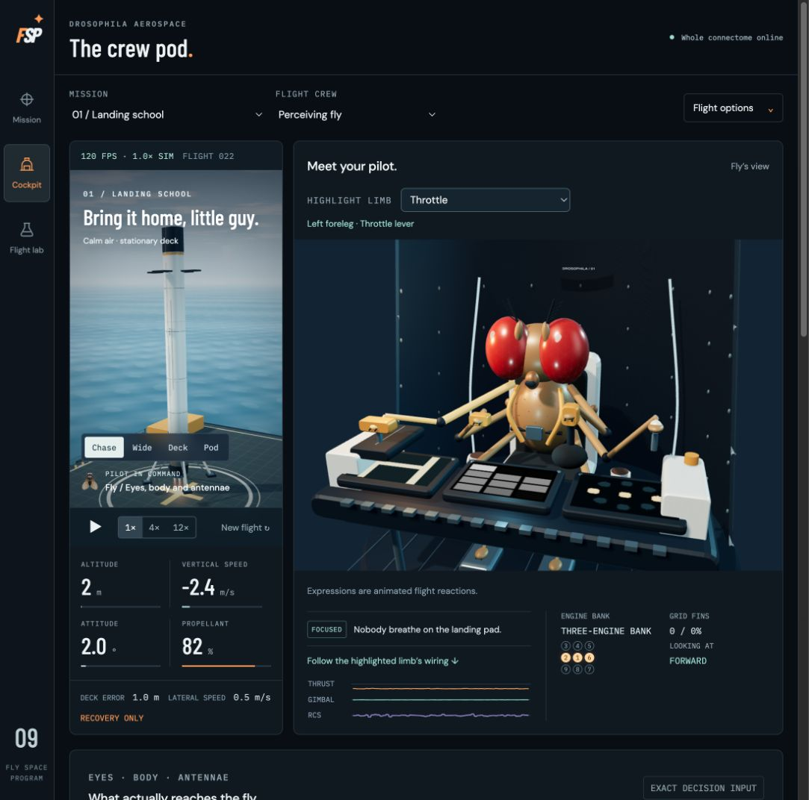
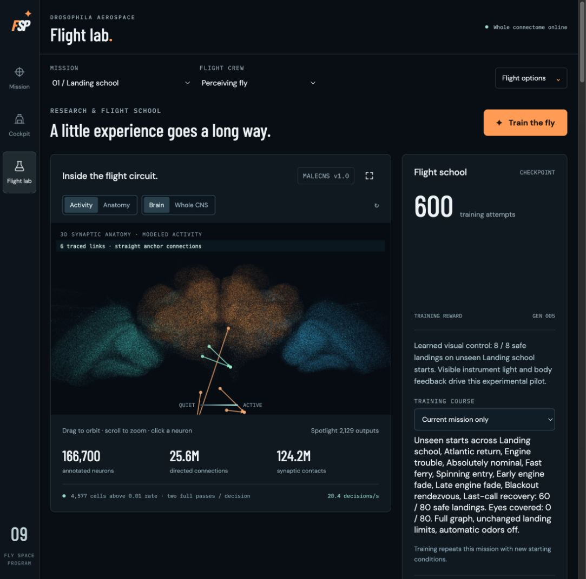

# The simulator, as it runs

These are actual browser captures of the deployed Fly Space Program on
14 September 2026. They were captured at the browser's normal viewport,
without replacing UI text, neural data or flight results. The flight was
briefly paused to capture a stable frame, then resumed. No new controller
training was started for these screenshots.

## Mission control

The spectator view shows a Landing School flight, current telemetry, camera
controls and the animated fly. Its local session counter is not a reserved
test cohort or a reliability estimate. Formal results are in the
[landing report](../dist/assets/landing-report.json).

## The crew pod

The fly's limbs follow authored actuator linkages; its expressions are
cosmetic. The sensory panel further down the page displays the exact
modeled eye images used by the controller. See
[controller architecture](controller-and-provenance.md) for the distinction
between the spectator scene and received sensory input.

## Flight lab

The anatomy viewer uses measured positions with modeled activity overlaid.
Highlighted links illustrate a small part of a decision; the whole retained
network still computes. The training and checkpoint cards describe software
state, not measurements from a living animal.

## The physical concept is a different kind of image

The [Fly Cube gallery](harness-concept.md) contains AI-generated design
mockups. It is explicitly separate from these software screenshots. No
physical Fly Cube has been built or tested.

Image dimensions, hashes, capture context and source revision are retained
in the [screenshot manifest](assets/screenshots/manifest.json).
