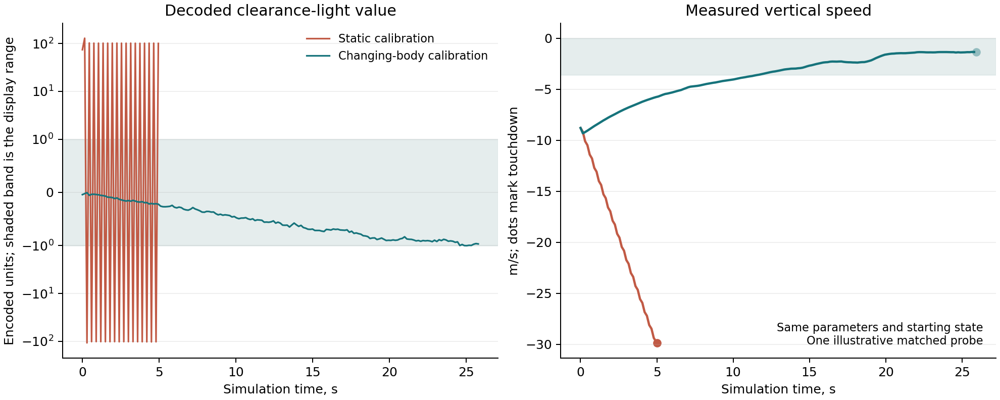

# Learning the full mission suite

The current work extends the first visual landing lesson toward all 27
missions. The packaged checkpoint landed **28/32 unseen starts across four
ground missions**, versus **0/32 with covered eyes** and **0/32 with the
indicators disabled**. These results do not establish mastery of the full
suite or transfer to a living fly.

## Presented information

The experimental cockpit uses 12 brightness indicators: measured clearance,
vertical speed, two deck-relative offsets, two deck-relative drift speeds,
pitch, roll, tangential speed, angular travel, destination altitude and fuel.
Destination altitude is a mission instruction. These indicators contain no
recommended throttle, attitude, descent target, or expert action. A camera
and engine display remain available on the other monitors.

The indicators pass through the same physical screen geometry and two
32 × 24 modeled eyes, with 4 × 4 area integration per retinal pixel. The
network receives 1,536 light channels and the existing 22 body/odor channels.
Covering the eyes hides the panel measurements. Disabling the indicators
removes their velocity information. Each of the 12 indicators has a tested
optical path to the retina.

All **166,700 neurons and 25,582,938 directed connections** participate in
both recurrent updates of every decision. The flight physics, decision
intervals, termination rules and success criteria are unchanged. There is
no preflight neural warmup that skips vehicle time.

## Sensory calibration

The static bench presents 2,048 independently randomized indicator patterns
and records 4,096 complete-network output samples. A changing-body bench
adds 6,912 samples from 384 contexts. In those contexts the independent
indicator pattern stays fixed while physical control positions, angular
motion and loads change. These are calibration presentations, not successful
flight trials. Random physical actions generate body feedback; an expert
controller supplies no actions or targets.

Regression fits the 12 actually presented, quantized brightness values and
16 body measurements from the 2,129 descending/motor activities. All samples
from one context remain in the same training or validation partition.
The validation partition selects regularization and is not a final test.
Source-data hashes are retained in the fitted sensory basis.

A later collection adds 3,778 samples from 24 complete flights on Landing
School, Atlantic Return, Fast Ferry and Spinning Entry. Those flights use a
previously learned controller; their targets are the displayed light values
and body feedback, without expert actions. The original calibration remains
preserved. A separate fit combines all 14,786 samples, holding complete
flight contexts together when selecting regularization. On the four held-out
flight contexts, excluding their first eight decisions, the deck-offset
decoding RMSE fell from 0.177/0.185 to 0.113/0.113 encoded units. This is a
calibration development comparison, not independent flight validation.

Static calibration alone was misleading: changing body feedback during
flight produced very large decoding transients and three failed probes.
Adding changing-body and startup examples corrected that failure in the
subsequent probe. The cold network remains part of every flight test. A
worker-dispatch error during data collection was caught through sample
counts; the affected static data were regenerated and the corrected dynamic
collection was checked for mode, count and buffer length before fitting.



This illustrative probe holds the control parameters and initial state fixed.
It demonstrates the calibration failure and correction on one start, rather
than estimating the reliability of a trained controller. The current
[training snapshot](suite-training-progress.json) retains its source hashes.

The fitted coordinates are folded into the ordinary 21,300-coefficient
output readout. The runtime decoder reads neural activity; it does not
receive the calibration labels, numerical instrument measurements, or an
additional navigation array. Some coefficients are large because visual
activity is weak in this normalized rate model. These unitless coefficients
are not biological muscle gains or chemical doses.

## Flight learning and current evidence

Reward-based search first adjusts the vertical-control directions, then
releases symmetric lateral directions and attitude damping. The network
weights within the anatomical graph remain fixed. This is learning in the
external decoder, not demonstrated learning inside an animal.

An early vertical candidate completed **8/12 new selection starts**, versus
**0/12 with the eyes covered**, using matched seeds and alternating nominal
and variability-0.4 conditions. This is a model-selection result, not the
final unseen test of a released checkpoint. The exact parameters and weight
hash are recorded in
`artifacts/suite-training/vertical-selection/selection.json`.

The next vertical branch changes training seeds and includes variability
0.4. Its search fitness adds a touchdown-margin term to the original flight
reward: for successful landings, it subtracts three times the sum of squared
vertical and lateral touchdown speeds. The original reward and actual
success result remain recorded separately. The success thresholds are not
relaxed. The first attitude branch starts from the same selected vertical
candidate and trains on Landing School, Atlantic Return and Fast Ferry.

After 450 complete training flights, the revised vertical branch landed
**9/12 of the same selection starts**, versus **0/12 with covered eyes**.
Two visible-eye flights still exceeded the original touchdown-speed limit,
and one timed out. Reusing the selection set makes this a development
comparison, not a final unseen result. The attitude branch reached 3/3
landings in its last training batch, but its separate six-start pitch-gain
check landed only 1/6. A combined ground branch then ran 576 training flights,
ending with 2/6 landings in its final batch. A separate yaw-gain sweep
demonstrated that its positive yaw feedback aggravated the spinning-entry
mission. The selected negative-gain candidate stopped that failure but did
not establish reliable landings by itself.

The correlated attitude branch uses the complete-flight sensory calibration
and searches correlated parameter changes so that steering and damping can
adjust together. It includes Spinning Entry and changing seeds with nominal
and variability-0.4 conditions. Generations two and three each landed 8/8
training cases. The branch completed 768 training flights in eight generations;
the released candidate remains frozen at generation two. That candidate had
a separate 16-start model-selection comparison with matched covered-eye controls.
It landed 12/16 with visible inputs and 0/16 with covered eyes: 4/4 on
Landing School, 2/4 on Atlantic Return, 3/4 on Fast Ferry and 3/4 on Spinning
Entry. That set used nominal physics for Landing School and Fast Ferry,
and variability 0.4 for the other two missions. Its four failures were two
hard landings, a timeout and a missed ship.

A subsequent 32-start test uses separate seeds and balances nominal and
variability-0.4 conditions within each of the four missions. It ran the
same frozen generation-two weights through the JavaScript backend, with
matched eyes-covered and indicators-disabled conditions. All 96 complete
trajectories finished under the original mission criteria.

| Mission | Visible inputs | Covered eyes | Indicators disabled |
| --- | ---: | ---: | ---: |
| Landing School | 7/8 | 0/8 | 0/8 |
| Atlantic Return | 7/8 | 0/8 | 0/8 |
| Fast Ferry | 7/8 | 0/8 | 0/8 |
| Spinning Entry | 7/8 | 0/8 | 0/8 |

The visible-input condition landed 16/16 nominal flights and 12/16 varied
flights. Its four failures were three timeouts and a missed ship. Eight
starts per mission provide limited evidence; the result is an experimental
flight capability, not a reliability certification. The frozen weight hash
is `5c01d3c5a48a435d6d226ea1f8b5b1a2372c48b1e2248479595281ee1cfc4cf5`.
The [packaged report](../dist/assets/landing-report.json) retains every
failure, paired condition, physical variation and source hash.

Checkpoint loading and the shared browser trainer now preserve the selected
sensory-panel version. Existing two-light checkpoints retain their original
presentation. The browser shows the twelve-field legend only for the new
panel, and checkpoint validation rejects unsupported panel names.
Browser inspection verified the twelve-cell display, illuminated retinal
images and black retinas with the eyes covered. It also exposed and fixed
a stale 3D cockpit texture: changing from the reference dashboard to the
sensory image now releases the old GPU allocation before resizing. The
pod's monitors then display the same images used by the sensory model.

The other missions, including the full orbital trips, remain unverified
with this experimental controller. A one-start survey of the remaining
ground profiles is a development probe, not an additional reliability test.
Across all 24 ground profiles, that survey landed 11/24 nominal starts.
All six engine-failure profiles failed. Stronger winds, a turning vessel,
low fuel and the high-speed return also exposed failures. The exact cases
and outcomes are retained in `artifacts/suite-training/ground-suite-scout/scout.json`.

## Engine recovery experiments

The first engine-bank comparison ran twelve complete flights: one- and
three-engine commands on each of the six engine-failure profiles. Both
conditions failed all six starts. The three-engine condition timed out in
every case, showing that changing the bank also requires a throttle change.

The search therefore adds three calibrated directions: measured selector
position into throttle, and body vibration and throttle position into the
engine-bank command. These are learned output coefficients using the
existing body inputs. The anatomical network and runtime readout format
remain the same. Setting the added coefficients to zero reproduced the
released checkpoint's exact weight hash and one complete JavaScript test
flight, including its original outcome.

An initial correlated search completed 576 flights in six generations
without a successful engine-failure recovery. It stopped after completing
its current generation. A separate two-dimensional grid then tested sixteen
combinations of selector-dependent throttle and vertical-speed feedback,
with four full flights per combination. The best combination landed 2/4:

| Development case | Physics | Outcome |
| --- | --- | --- |
| Landing School | Nominal | Touchdown at 2.32 m/s |
| Engine trouble | Variability 0.4 | Excess tilt and lateral speed |
| Early engine fade | Nominal | Touchdown at 2.77 m/s |
| Blackout rendezvous | Variability 0.4 | Hard landing at 5.41 m/s |

Another grid setting landed the dead-center-engine case, while its other
three cases timed out. The selected shared setting commands the
three-engine bank from the start. Reactive switching after a failure
remains unverified. These development cases selected the next starting
point; they do not establish independent reliability. Every grid case,
failure, parameter combination and archived source hash remains in
`artifacts/suite-training/engine-bank-grid/sweep.json`.

The next search included two normal missions and all six engine-failure
profiles, with changing seeds and physical variation. It releases steering
alongside throttle and engine selection because the grid also exposed
lateral and attitude failures. Its candidate ranking uses landing count
first, then the recorded reward and touchdown-margin fitness. Previously,
a zero-landing candidate with several timeouts displaced a two-landing
candidate from the search elites. Replaying that recorded generation
confirmed that the revised ordering retains three two-landing elites.
The physical success criteria and original rewards are unchanged. The
packaged controller remains the independently tested four-mission version.

That search completed 960 full flights in ten generations. The selected
candidate in each generation landed four or five of its eight development
cases; none reached six. Two subsequent 64-flight grids tested measured
throttle-position and felt-load feedback, then throttle-position feedback
with a command offset. A selected setting met the original vertical-speed
limit in all four grid cases, while only two passed every landing criterion.
The other cases missed the ship or had excessive lateral speed. These
coefficients are model search parameters, not calibrated muscle properties.

Four diagnostic trajectories exactly reproduced those grid outcomes. They
retained all decisions, presented measurements, and their neural decoding.
The later-flight decoding errors were small compared with the remaining
position and attitude failures. A separate steering search therefore starts
from that setting and includes the previously tested four missions alongside
all six engine-failure profiles. The grid, selected initialization and probe
are `engine-position-bias-grid/sweep.json`, `adaptive-steering-initial.json`
and `adaptive-sensory-probe/probe.json` under `artifacts/suite-training/`.
These are development measurements, with no new independent reliability claim.

## Orbital ascent experiments

The packaged controller completed three nominal orbital baseline trials,
one per orbital mission, with the same frozen weight hash. All three returned
before reaching space. Their maximum altitudes were 19.71, 20.46 and
19.96 meters, and all flights ended after approximately 230 simulated
seconds. The complete results are in
`artifacts/suite-training/orbital-baseline/baseline.json`.

The orbital search adds seven output directions using the existing visible
destination, tangential-speed, clearance and angular-travel indicators.
All seven start at zero. A complete JavaScript flight with those additions
inactive exactly matched the packaged weights and original flight outcome.
No new controller observation, phase flag or expert action is introduced.

Training also records a separate insertion reward, evaluated from physical
outcomes after each action. Let `d` be the sum of the absolute periapsis and
apoapsis errors divided by the mission altitude, plus absolute radial speed
divided by 40. The best finite `exp(-d / 4)` reached during the flight is
its insertion quality. The extra reward is 1,200 times that quality plus
200 times the fraction of destination altitude reached, capped at one.
This gives the search a smooth measure of progress toward a circular orbit.
The original reward, actual milestones and full mission result remain
separate. Computing this reward does not set any mission-completion flag,
and its measurements never enter the sensory packet or action calculation.

The first insertion lesson uses the complete-round-trip mission, with
nominal and variability-0.4 physics and changing training seeds. Every
candidate still runs to the original physical endpoint. Its success
criterion remains a full orbit followed by deorbit, entry and barge
touchdown. This stage has not yet established an orbital flight capability.

The first insertion search completed 72 full flights in three generations:
62 reached the launch milestone and 24 reached space. None achieved a stable
orbit, a full revolution or a completed return. The original flight reward
can favor an early low-altitude failure over a longer ascent. The next search
therefore ranks actual completed mission milestones before its smooth fitness,
after checking full-mission landings first. Among candidates with equal
milestones, orbital fitness uses one tenth of the original flight reward
plus the insertion reward. Ground-flight fitness is unchanged. Original
rewards and every failed endpoint remain recorded separately. This change
does not lower any physical milestone or completion criterion.

The new `orbital-progress` experiment starts from a recorded candidate chosen
under that ordering, preserves the old trials, and retains the version of its
selection rule and fitness. It still requires independent evaluation before
any orbital capability can be claimed.

## Optional native calculation

The optional Node backend evaluates every CSR row and edge with Float32
state, double accumulation, and the same activation. The newer implementation
overlaps two adjacent independent row sums, preserving addition order within
each neuron and the synchronous neural update.
It performs no pruning or approximation. The browser implementation stays
in JavaScript. A 100-decision comparison across five mission contexts,
including the supported gain change and a neural pulse, found exactly zero
activity and command differences. The latest comparison measured a 1.66×
speedup over JavaScript on the development machine. A separate 200-decision
comparison and two complete physical trajectories found zero activity and
command differences against the previous native implementation, with a
1.145× speedup. The flight comparisons reused development starts and check
calculation parity rather than new flight reliability. The build record
retains compiler flags, Node version, source hash and binary hash; new
training records retain that build metadata and verify the binary hash.

Final flight results must also run through the browser's JavaScript backend;
the native check alone does not establish flight reliability.

## Reproduction

Run the collections sequentially when recreating the calibration files:

```sh
node scripts/collect-suite-senses.mjs
SUITE_CALIBRATION_CONTEXTS=384 SUITE_CALIBRATION_PARTS=3 node scripts/collect-suite-senses.mjs --dynamic
artifacts/lif-runtime/bin/python scripts/fit-suite-senses.py --dynamic
node scripts/check-perception.mjs
SUITE_POPULATION=9 SUITE_BATCH=3 SUITE_GENERATIONS=10 node scripts/train-suite.mjs
node scripts/build-rate-native.mjs
node scripts/check-native-rate.mjs
artifacts/lif-runtime/bin/python scripts/report-suite-training.py
```

Training resumes the state in its named experiment directory. Use a new
`SUITE_BLOCK` for an independent experiment. `--evaluate` records all requested
matched conditions and writes a completion flag only after every flight
finishes. Artifacts retain failed trials as well as successes. The separate
[chemical panel](additional-odor-tests.md) did not identify a compound that
qualified for a steering follow-up.

When the direction layout or selection order changes, initialize a new
experiment directory with `SUITE_INITIAL` pointing to the prior checkpoint
or parameter file. The trainer rejects incompatible saved search states.
