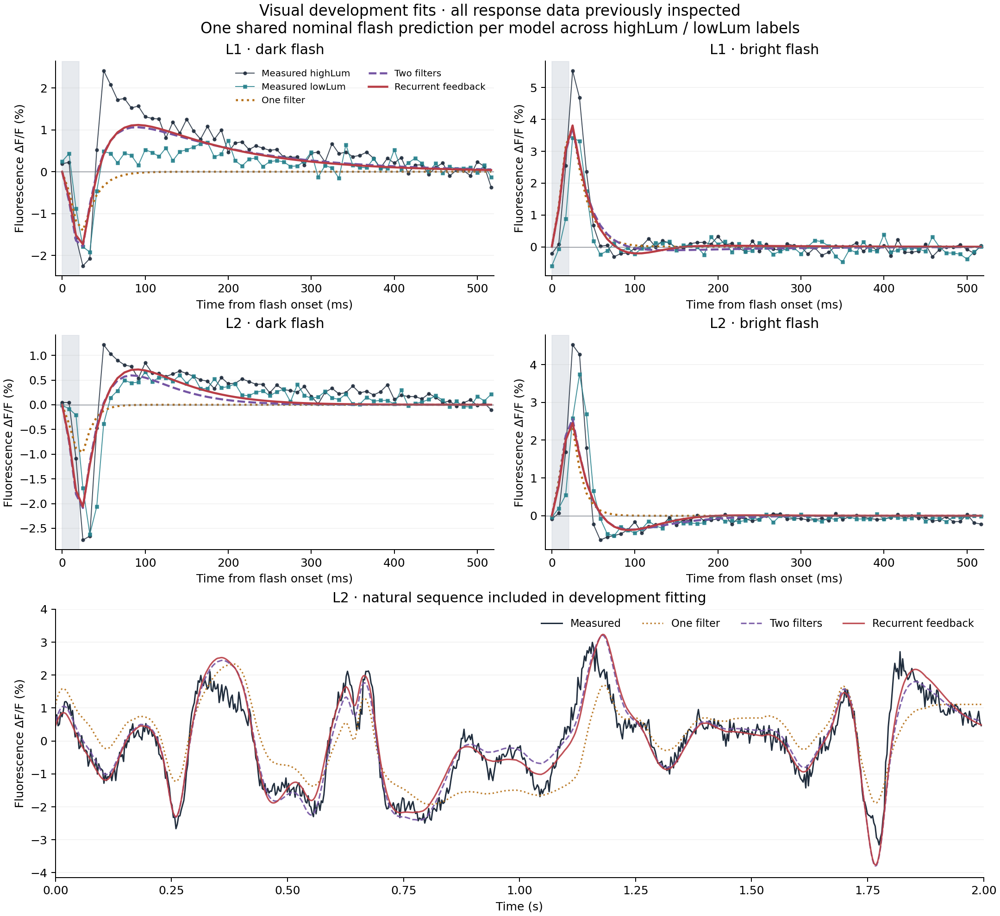

# Recurrent visual-response development model

The sign-dependent feedback model completed all predeclared fits and reduced
mean trace squared error by **2.80% for L1 and 4.02% for L2** relative to the
two-filter model refitted on the same data. It also predicts the direction
of both measured dark-flash chemical changes in all four named conditions.
It fails four bright-flash window comparisons, so increasing feedback alone
does not explain the complete chemical-response pattern at these fitted
parameters.

These are development results. All control and natural-response targets had
already been inspected, and the CDM means had been examined in the preceding
[measured chemical comparison](cdm-response-comparison.md). The original
[independent-stimulus transfer failure](visual-response-benchmark.md) remains
unchanged. No fitted parameter has been installed in the connectome.

## Complete fitting comparison

L1 uses four 63-bin traces: dark and bright flashes in both compact
`highLum` and `lowLum` conditions. L2 uses its corresponding four traces
and all 708 samples of the natural sequence. Each whole trace receives equal
objective weight; L2's longer natural record counts as one trace. The fit
contains no condition-specific gain, output rescaling, delay, or response-derived
initial state. Physical brightness mapping remains unverified, so the model
uses the same nominal input for both luminance labels and cannot explain their
differences from those labels alone.

The table reports the square root of mean trace MSE, in percentage points
of fractional fluorescence. Lower values indicate closer development fits.

| Cell | One filter | Two filters | Recurrent feedback | MSE reduction from two filters |
| --- | ---: | ---: | ---: | ---: |
| L1 | 0.56818 | 0.41753 | 0.41165 | 2.80% |
| L2 | 0.60620 | 0.43090 | 0.42215 | 4.02% |



All 32 planned attempts converged and passed physical and numerical checks:
three one-filter, nine two-filter, and four recurrent starts per cell. The
same solver settings apply to every family; different restart counts do not
establish equal computation or a global optimum. Every attempt, selection,
curve and diagnostic is retained in the
[full result](visual-recurrent-development-results.json).

Neither selected recurrent fit touches an engineering bound. Their
range-scaled Jacobian condition numbers are approximately 178 and 126.
The selected L2 two-filter fit nearly reaches the **lower** slow-gap bound
of 2 ms and has a condition number around 734,223: large, nearly canceling
filter amplitudes can produce similar predictions. This cautions against
interpreting those individual comparator parameters. The recurrent values
also remain effective observation-model coefficients, without a unique
physiological interpretation.

L2's recurrent natural-response RMSE is 0.0046901 fractional fluorescence,
with zero-reference skill 0.86091 and correlation 0.93632. That natural trace
was explicitly included in this fit. These numbers are not a new transfer
test or evidence of independent prediction.

The L2 gain mostly comes from dark flashes, whose MSE falls by 15.46% and
12.04% in the high/low conditions. Its highLum bright MSE worsens by 3.67%,
and natural-response MSE improves by only 0.0921%. The average improvement
therefore does not mean every response is better explained.

## Model and numerical evidence

The model follows the sign-dependent recurrent-feedback hypothesis in
[Pang et al.](https://pmc.ncbi.nlm.nih.gov/articles/PMC11769683/), expressed in
fluorescence coordinates:

```text
I = A_on * max(C, 0) - A_off * max(-C, 0)
tau_v * r' = -r - w*a + I
(tau_v + gap) * a' = -a + h(r)*r
h(r) = g when r >= 0, otherwise 1-g
```

Positive `r` denotes hyperpolarization-associated fluorescence. Feedback
depends on response sign. The six parameters are `tau_v`, `gap`, `w`, `g`,
`A_on`, and `A_off`; no separate output gain is introduced. The engineering
bounds and all initial guesses were frozen before fitting. `w` and `g`
have no established mapping to chemical concentration or synaptic release.

The simulator splits at stimulus edges and response-sign crossings, uses
matrix exponentials within each linear regime, integrates the recorded
flash bins, and checks continuous extrema for positive fluorescence.
Natural initialization settles using the stimulus alone. Startup and periodic
predictions use the same continuous periodic-mean normalization. The
original acquisition-timing and fluorescence-processing approximations remain.

The numerical method passed 60 synthetic checks and 62 additional independent
checks, including two adverse numerical counterexamples. The fitting pipeline
and frozen plan passed 203 checks, including 66 injected-failure checks.
Optimizer, Jacobian and selected-verification failures are preserved; a failed
selected verification cannot silently substitute a different restart.
Tighter event/settling settings changed the selected fitted and saved startup
curves by at most `2.22e-16`. These are numerical convergence observations,
not formal error bounds or proof of biological accuracy.

A separate completed-fit audit passed 680 checks, independently reproduced
all 27 selected traces within `1.462e-12` fractional fluorescence, and
recomputed all 32 attempted-fit scores. Its recurrent replay used a separate
adaptive ODE integrator, including integrated flash bins and stimulus-only
natural initialization. All 63 checked input/artifact hashes remained unchanged.

## Chemical direction check

After freezing both completed fits, a separate fixed plan evaluated increasing
`w` with every other parameter held fixed. It retained both signs of three
relative increments—1%, 0.1%, and 0.01%—and used the smallest forward step
for the local direction. Central differences checked step convergence and
sign stability. No increment was selected for agreement with the data.

All 16 primary comparisons were numerically evaluable. **Twelve agreed in
direction and four disagreed.** The eight dark-flash comparisons all agree:
the signed early response decreases and the late rebound increases in both
L1/L2 named conditions. The bright-flash discrepancies are:

| Cell / condition | Window | Measured raw CDM-minus-control change | Predicted raw change for increasing `w` |
| --- | --- | --- | --- |
| L1 / highLum | Late | Increase | Decrease |
| L2 / highLum | Early | Increase | Decrease |
| L2 / highLum | Late | Increase | Decrease |
| L2 / lowLum | Late | Increase | Decrease |

Early and late mean 0–50 and 50–250 ms, using exactly the original trailing
bin overlaps. These are fixed windows, not response-dependent phase or peak
measurements. All eight full traces, recovery/whole-window comparisons,
derivatives and step checks remain in the
[complete direction result](visual-feedback-direction-results.json).

This rejects complete **local feedback-strength-only directional consistency**
at the selected control fits under this observation model. It does not exclude
larger nonlinear parameter changes, other mechanisms, luminance effects, or
real octopamine biology. Sign agreement establishes neither effect size nor
statistical significance. The archived CDM experiment used a brain bath;
there is still no demonstrated airborne chemical steering intervention.

The independent direction audit passed 375 checks. It integrated separate
ODE sensitivity equations for the infinitesimal derivative with respect to
`w`, reproducing all four bright mismatches, and used rational bin geometry
to verify every window. The discrepancies persist across all three step sizes
and in the direct sensitivity calculation. They are not artifacts of the
numerical sign cutoff. The 16 comparisons are descriptive comparisons of
population means, not 16 independent animals or independent model predictions.

A subsequent [context-identifiability analysis](visual-context-identifiability.md)
finds a stronger limit under the current shared-input assumptions: any common
parameter change predicts identical high/low changes. Two exported bright-flash
window pairs have opposite mean signs, making at least two disagreements
unavoidable. This is a constraint on reproducing those point estimates, not a
statistical rejection of the biological mechanism. A bounded author-source
search did not recover the exact export-to-stimulus calibration mapping;
that physical context must be resolved before adding condition-specific inputs.

The fitting, reporting and directional calculations are respectively
`scripts/fit-visual-recurrent-development.py`,
`scripts/report-visual-recurrent.py`, and
`scripts/check-visual-feedback-direction.py`. Immutable experiment inputs,
plans, source snapshots, attempts and numerical reviews are retained under
`artifacts/odor-interface/visual-recurrent-development`. The independent T4
response values remain excluded from this work and require a separate
pathway-appropriate validation plan.
