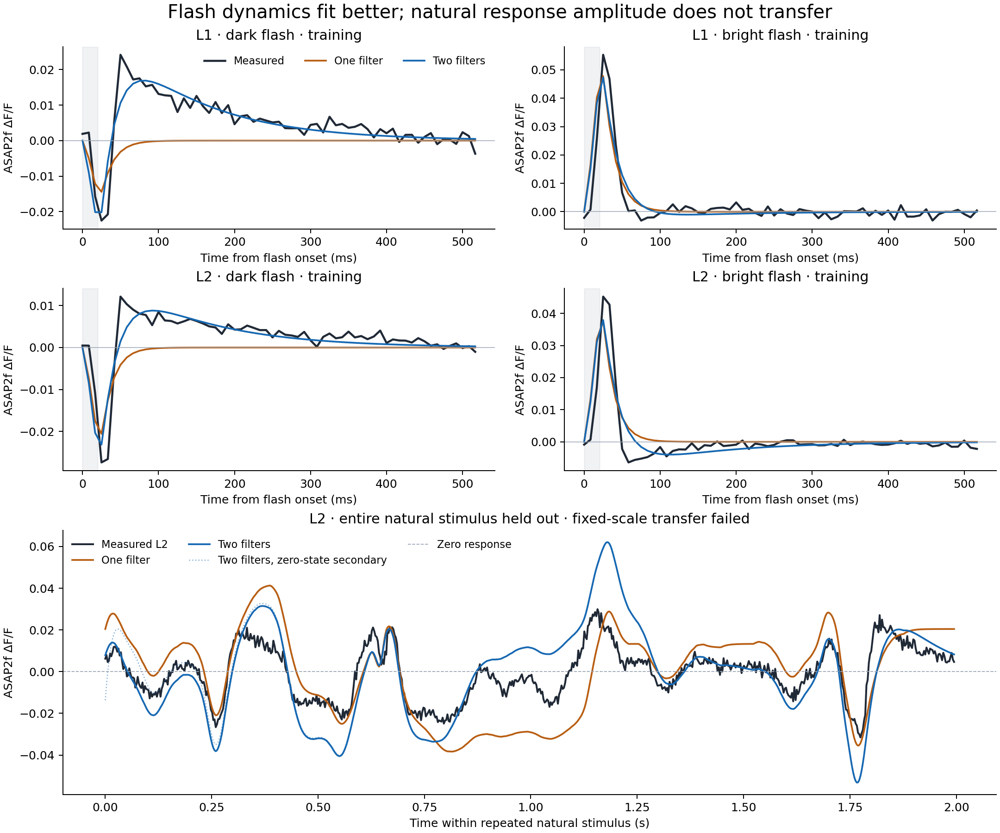
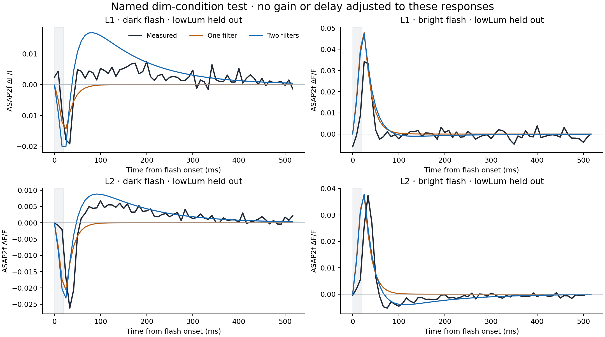

# Empirical visual-response benchmark

The first measured-response benchmark **fails its frozen transfer rule**.
A two-filter model fits bright and dark flash responses better than a
one-filter reference, but its prediction of the entire held-out natural
stimulus has higher absolute error than a zero-response reference. It is
not qualified for installation as visual physiology in the connectome.

L1 and L2 normally use graded voltage signals. Published ASAP2f recordings
show increased fluorescence with hyperpolarization and decreased fluorescence
with depolarization. This makes a voltage-indicator response an appropriate
calibration target; requiring these neurons to emit action potentials would
misstate their biology. [Pang et al., Current Biology](https://pmc.ncbi.nlm.nih.gov/articles/PMC11769683/)

## Data and frozen split

The measured population-mean exports come from Michelle Pang, Feng Chen,
Marjorie Xie, Shaul Druckmann, Thomas Clandinin and Helen Yang's
[CC-BY-4.0 archive](https://doi.org/10.5281/zenodo.13367946).
The archive checksum and all copied data-file checksums were verified.
These are measured response arrays, not fitted notebook predictions. The
predictions and plots here use a newly written benchmark.

Training uses only the `highLum` dark and bright flash responses, separately
for L1 and L2: four traces of 63 bins. All `lowLum` responses and the entire
708-point L2 natural-stimulus response are held out. Parameters were frozen
before evaluation. The natural export contains 52 ROI traces but no animal
identifiers. This is a stimulus-level test, not animal-level cross-validation.
The high/low filenames lack a verified physical-radiance mapping.

The nominal flash is a contrast of −1 or +1 for 20 ms starting at time zero.
Predictions use exact trailing 1/120-second bin averages at the stored bin
end times. The independently reconstructed natural stimulus uses all 600
quantized luminance samples from sequence two, held for 1/300 second each.
Every sample matches the archive's stimulus figure. Its displayed time axis
is slightly stretched, so replay uses the experimental display rate.

## Model and observation assumptions

A one-filter reference has a time constant and separate positive amplitudes
for light increments and decrements. The candidate subtracts a slower
filter from a faster one, with separate ON/OFF amplitudes for each. Each
filter follows `τ dx/dt = u − x`, driven by the positive or negative part
of contrast. The output signs preserve the recorded fluorescence polarity.
These are effective fluorescence dynamics, not absolute voltage, synaptic
release or uniquely identified physiological parameters.

The candidate has six fitted parameters per cell type. Its fast time
constant is bounded to 2–80 ms; its slower time constant adds a positive
2–800 ms gap. Amplitudes are bounded to 0–2 fractional fluorescence units.
Nine deterministic starts per cell fit the candidate and three fit the
reference. All 24 optimizer records are retained, all converged, and none
of the selected parameters hit a bound. Training error alone selects the
restart. No intercept, delay, natural-response gain or target-derived
initial state is fitted.

The natural response averages repeated presentations, so the primary
prediction starts at the exact periodic state computed from the stimulus.
A zero-state startup is retained as a secondary comparison. The original
flash and natural recordings also use different fluorescence baselines:
late gray versus an exponential trend fitted to all frames. The benchmark
approximates this difference using `(1+y)/(1+μ)−1`, where μ is the exact
continuous cycle mean of the periodic prediction. It uses no held-out
response value. The same μ is used for startup, and unconverted predictions
are also retained. This approximates the authors' normalization under slow
bleaching and balanced phase sampling; it does not reproduce their full
image-processing pipeline. [Natural baseline selector](https://github.com/ClandininLab/L1L2-recurrent-feedback/blob/7fa5829e37d566e02beaaa87efd6a0f1de4e48c0/stimulus/NaturalisticStimulus_1D_FullField.m), [fluorescence normalization](https://github.com/ClandininLab/L1L2-recurrent-feedback/blob/7fa5829e37d566e02beaaa87efd6a0f1de4e48c0/imaging-analysis/computeDFF.m)

Acquisition alignment remains uncertain within an imaging interval, and the
compact corrected-timing export's full lineage is unresolved. The isolated
flash approximation may also miss adaptation from repeated stimuli. These
limits remain explicit; they were not adjusted to improve test performance.

## Results

The primary gate requires valid predicted fluorescence for all three models
under both initialization choices. The candidate must then have positive
correlation and smaller natural-stimulus RMSE than both references. All
models pass positivity, but the candidate fails the RMSE requirement.

| Natural stimulus, periodic state and converted baseline | RMSE, fractional ΔF/F | Skill relative to zero | Correlation |
| --- | ---: | ---: | ---: |
| Zero response | 0.012576 | 0 | Undefined |
| One filter | 0.014601 | −0.348 | 0.718 |
| Two filters | 0.013015 | −0.071 | 0.829 |

Skill is `1 − sum(error²)/sum(measured²)`. Negative values mean a larger
squared error than predicting zero. Correlation alone cannot establish
calibrated amplitude or a passing result. The two-filter startup comparison
also fails against zero, with RMSE 0.013016.



The named dim-condition checks remain separate secondary outcomes. No
brightness-specific gain is fitted. The candidate beats zero for L1 bright,
L2 dark and L2 bright responses, but fails L1 dark: RMSE 0.006034 versus
0.004830 for zero. Its excessive rebound is visible below.



## What accounts for the failed predictions

A post-test calculation separates the error in all 24 preserved evaluation
traces without changing predictions or fitting a correction. Using population
standard deviations over the originally scored samples, the exact identity is

`MSE = (mean prediction − mean measurement)² + (SD prediction − SD measurement)² + 2 × SD prediction × SD measurement × (1 − correlation)`.

The three terms describe mean bias, amplitude mismatch and correlation/shape
mismatch. They are an arithmetic accounting, not identified biological causes.

| Two-filter prediction | Predicted / measured SD | Mean-bias share of MSE | Amplitude share | Shape share |
| --- | ---: | ---: | ---: | ---: |
| Natural stimulus, primary | 1.7003 | 0.225% | 45.672% | 54.103% |
| Natural stimulus, saved zero-state comparison | 1.6847 | 1.810% | 43.656% | 54.533% |
| Low luminance, L1 dark | 1.5811 | 20.795% | 19.030% | 60.175% |

The natural primary prediction therefore fails through a combination of
excess variation and imperfect shape, with little remaining mean bias. The
already applied, prediction-only fluorescence conversion reduced the raw
periodic diagnostic's MSE by 56.27%; it did not resolve those remaining errors.
The saved zero-state comparison has MSE only 0.0177% higher than the primary
prediction, so both retained startup choices share this failure.

The shape term combines temporal dynamics, possible alignment error, noise
and unmodeled effects. It cannot identify a delay or select a biological
mechanism. No gain, offset or timing correction was estimated or installed.
Zero predictions have undefined correlation; their missing response variation
is kept in the amplitude term without claiming shape agreement.

The [complete error decomposition](visual-response-error-audit.json) preserves
all 24 records and both equivalent MSE identities. Every previously reported
metric matches, with identity residuals below `8.14e-20`. Reproduce it with
`python3 scripts/summarize-visual-response-errors.py`; the calculator reads
only frozen prediction vectors and uses the Python standard library.

## Consequence for chemical experiments

This supplies an empirical target and exposes a failed generalization before
changing the network. It does not establish a functioning visual-motion
pathway, odor-dependent visual gain or a chemical that improves steering.
The next physiology model needs independent evidence for response amplitude,
adaptation and graded transmission, followed by another stimulus-level test.
These already inspected natural responses can inform development but cannot
serve as an unseen final test for a revised model. Behavioral or chemical
claims still require the corresponding controlled experiment.

## Independent data availability

A bounded source review found two promising archives, but neither currently
supplies a complete, verified new visual input/response pair. No new response
curves were inspected or fitted during this review.

[Ketkar and Sporar et al. (2020)](https://www.sciencedirect.com/science/article/pii/S0960982219316719)
measured L2/L3 ASAP2f responses to longer luminance changes. Its
[CC BY 4.0 dataset](https://data.mendeley.com/datasets/p7xskvwktk/1) lists the
numeric imaging archive, but ordinary retrieval returned HTTP 403. The
accessible author code also leaves a timing discrepancy: the paper specifies
30 Hz interpolation, while the Figure 7 analysis calls an absent 40 Hz loader.
The recorded timestamps, stimulus mapping and ROI selection need verification
before defining a new test. Neither rate can be chosen by fit quality.

The [Li et al. author archive](https://github.com/JuusolaLab/SK_Slo_Paper/tree/a207530b6ad7377d63a779f2842ffce7f6f1c5c4)
contains a small wild-type photoreceptor voltage export, `WTVol.mat`, with
1,000 samples in six columns. Schema and source-code inspection found no
corresponding luminance waveform, exact natural-stimulus library identifier,
or recorded current-command/voltage pair. The available current matrix is
simulated, and the dynamic-clamp scripts infer currents from target voltages;
those cannot replace an independently measured input. The checked arrays'
response values remained uninspected. The missing stimulus and synchronization
information therefore remain concrete prerequisites, not a completed test.

The source review, file hashes, schemas and follow-up are retained under
`artifacts/odor-interface/visual-response-benchmark/external-source-review`.

## Verification and reproduction

An independent calculation verified all 24 training restarts, every selected
parameter, 32 retained trace/metric records, and the failed gate. Prediction
differences were below `2.6e-15`; no alternative fit was made. Separate
synthetic checks compared the exact flash integral with numerical quadrature,
verified periodic closure and cycle means, and checked interval extrema.
Both output figures were visually inspected.

The [complete verified record](visual-response-benchmark-results.json)
contains the frozen plan, all training attempts, all test predictions,
metrics and source hashes. Data remain attributed to the archive authors.
The script refuses to overwrite a frozen fit or completed evaluation.
With the verified archive files in the experiment's `data` directory and
the original frozen plan, the stages are:

```sh
artifacts/lif-runtime/bin/python scripts/benchmark-visual-response.py fit
artifacts/lif-runtime/bin/python scripts/benchmark-visual-response.py evaluate
artifacts/lif-runtime/bin/python scripts/summarize-visual-response.py
```

The first two commands are for reproducing in a fresh experiment copy.
The last command verifies and plots the existing completed result without
fitting or changing its parameters.
